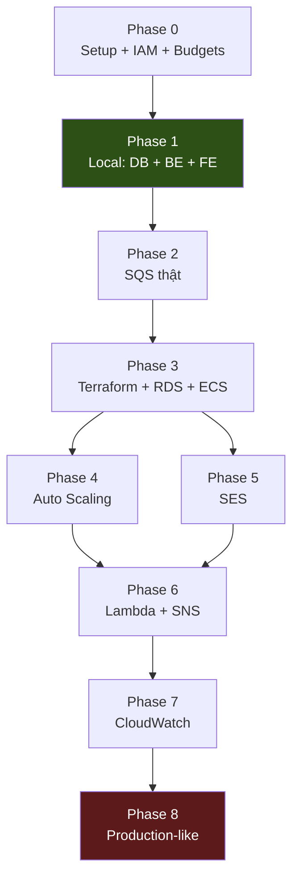

# TaskFlow Cloud — Hướng dẫn triển khai từng bước

Bộ tài liệu này là **hướng dẫn thực hành**, đi kèm với [thiết kế tổng quan](../taskflow_cloud_design.md).
Thiết kế trả lời "làm cái gì và vì sao". Bộ này trả lời "gõ cái gì, theo thứ tự nào".

**Đối tượng:** người đã biết Laravel + React, **chưa quen AWS**. Mỗi lần một dịch vụ AWS xuất hiện lần đầu đều có khối giải thích:

> 💡 **Giải thích:** dịch vụ này là gì, giải quyết vấn đề gì, và vì sao dự án cần nó.

---

## Danh sách phase

| Phase | File | Nội dung | Thời gian | Chi phí |
|---|---|---|---|---:|
| 0 | [phase-0-setup.md](phase-0-setup.md) | Tài khoản AWS, IAM, Budgets, công cụ local | 1 buổi | $0 |
| 1 | [phase-1-local.md](phase-1-local.md) | DB + Laravel API + React + worker, **100% local** | 2–3 tuần | $0 |
| 2 | [phase-2-sqs.md](phase-2-sqs.md) | SQS thật, DLQ, đổi driver | 1 tuần | < $1 |
| 3 | [phase-3-aws-infra.md](phase-3-aws-infra.md) | Terraform, VPC, RDS, S3, ECR, ECS Fargate | 2 tuần | ~$15/th |
| 4 | [phase-4-autoscaling.md](phase-4-autoscaling.md) | Auto Scaling, SIGTERM, load test | 1 tuần | +$5 |
| 5 | [phase-5-ses.md](phase-5-ses.md) | SES, email, bounce/complaint | 4 ngày | ~$0 |
| 6 | [phase-6-lambda.md](phase-6-lambda.md) | SNS, Lambda, EventBridge | 1 tuần | ~$0 |
| 7 | [phase-7-cloudwatch.md](phase-7-cloudwatch.md) | EMF metrics, dashboard, alarms | 1 tuần | +$5/th |
| 8 | [phase-8-prod-like.md](phase-8-prod-like.md) | ALB, private subnet, HTTPS, CI/CD → destroy | 3 ngày | ~$8 |

**Tài liệu ngang (cắt qua nhiều phase):**

| File | Nội dung |
|---|---|
| [frontend-guide.md](frontend-guide.md) | **Toàn bộ phần React** — stack, cấu trúc, từng màn hình theo phase, mẫu UX cho hệ thống bất đồng bộ, và deploy S3 + CloudFront |

> Các file phase mô tả FE khá mỏng vì chúng tập trung vào AWS. Khi làm phần giao diện, đọc `frontend-guide.md` — nó là bản đầy đủ.

**Deadline credits: 22/01/2027.** Phase 1 dài nhất và tốn $0 — cứ làm kỹ, đồng hồ chi phí chưa chạy.

---

## Chiến lược chống conflict giữa các phase

Đây là phần quan trọng nhất của tài liệu này. Nguyên nhân số một khiến dự án học AWS chết giữa chừng là **phase sau bắt phải viết lại phase trước**: đổi schema, sửa business logic, đập đi làm lại hạ tầng. Tám nguyên tắc dưới đây được thiết kế để điều đó không xảy ra.

### Nguyên tắc 1 — Schema đầy đủ ngay từ Phase 1

Toàn bộ cột của cả 8 phase được viết trong **một lần migration duy nhất** ở Phase 1, kể cả cột tới Phase 6 mới dùng (`heartbeat_at`, `notify`, `cancel_requested`).

Cột thừa ở Phase 1 hoàn toàn vô hại. Ngược lại, `ALTER TABLE` ở Phase 5 khi đã có RDS và dữ liệu thật thì phiền hơn nhiều. **Không có migration "sửa lại" ở bất kỳ phase nào sau Phase 1.**

### Nguyên tắc 2 — Interface trước, implementation sau

Mỗi thứ sẽ đổi giữa các phase đều nấp sau một interface định nghĩa ở Phase 1:

| Interface | Phase 1 | Phase sau |
|---|---|---|
| `JobQueue` | `DatabaseJobQueue` | `SqsJobQueue` (P2) |
| `EventEmitter` | `LogEventEmitter` | `SqsEventEmitter` (P6) |
| `ResultStorage` | `LocalResultStorage` | `S3ResultStorage` (P3) |
| `Metrics` | `NullMetrics` | `EmfMetrics` (P7) |
| `Mailer` | Laravel `log` driver | `SesMailer` (P5) |

Đổi phase = **đổi một dòng trong config**. `JobProcessor`, `JobDispatcher`, các `Handler` — không sửa một dòng nào từ Phase 1 tới Phase 8.

### Nguyên tắc 3 — `DatabaseJobQueue` mô phỏng đúng ngữ nghĩa SQS

Đây là mẹo quan trọng nhất của Phase 1. Thay vì dùng Laravel database queue (ngữ nghĩa khác SQS), ta tự viết một bảng `job_queue_messages` có đủ: `receipt_handle`, `receive_count`, `visible_at`, redrive sang DLQ.

Kết quả: code worker viết ở Phase 1 chạy y nguyên trên SQS thật ở Phase 2, và bạn **học được visibility timeout / DLQ mà không tốn xu nào**. Phase 2 chỉ còn là bài kiểm tra xem hiểu đúng chưa.

### Nguyên tắc 4 — Config-driven, không code-driven

Mọi lựa chọn hạ tầng nằm trong `config/taskflow.php`, đọc từ env:

```php
'queue_driver'   => env('TASKFLOW_QUEUE_DRIVER', 'database'),   // database | sqs
'event_driver'   => env('TASKFLOW_EVENT_DRIVER', 'log'),        // log | sqs
'storage_driver' => env('TASKFLOW_STORAGE_DRIVER', 'local'),    // local | s3
'metrics_driver' => env('TASKFLOW_METRICS_DRIVER', 'null'),     // null | emf
```

Bạn có thể chạy Phase 4 rồi mà vẫn `TASKFLOW_QUEUE_DRIVER=database` để debug offline. Các phase **cộng dồn**, không thay thế nhau.

### Nguyên tắc 5 — Terraform: mỗi phase THÊM module, không SỬA module cũ

```
infrastructure/terraform/
├── modules/
│   ├── network/      # P3 — tạo, không đụng lại tới P8
│   ├── queues/       # P2 (import), P6 thêm notifications queue
│   ├── storage/      # P3
│   ├── compute/      # P3 — P4 chỉ THÊM file autoscaling.tf
│   ├── autoscaling/  # P4
│   ├── messaging/    # P5 (SES) + P6 (SNS/Lambda)
│   └── monitoring/   # P7
└── envs/
    ├── learning/     # P2–P7 dùng chung, cộng dồn module
    └── prod-like/    # P8, state riêng, destroy sau 3 ngày
```

Mỗi phase thêm một block `module "..."` mới vào `envs/learning/main.tf`. Không sửa module đã xong. `prod-like` có **state file riêng biệt** nên Phase 8 không bao giờ đụng vào hạ tầng learning.

### Nguyên tắc 6 — Naming convention cố định từ Phase 0

Chốt một lần, dùng suốt 8 phase. Đổi tên giữa chừng là nguồn conflict lớn nhất trong Terraform.

```
Prefix chung        : taskflow
Region              : ap-southeast-1        (điền region bạn chọn ở Phase 0)
SQS                 : taskflow-jobs, taskflow-jobs-dlq
                      taskflow-notifications, taskflow-notifications-dlq
ECR repository      : taskflow-api, taskflow-worker
ECS cluster         : taskflow
ECS service         : taskflow-worker, taskflow-api
RDS instance        : taskflow-db
S3 bucket           : taskflow-results-<ACCOUNT_ID>
S3 tfstate          : taskflow-tfstate-<ACCOUNT_ID>
SNS topic           : taskflow-ops-alerts
CloudWatch log group: /taskflow/<component>
SSM parameter       : /taskflow/<env>/<KEY>
IAM role            : taskflow-<component>-role
Tag                 : Project=taskflow, Environment=learning|prod-like
```

Bucket S3 phải unique toàn cầu nên gắn thêm ACCOUNT_ID.

### Nguyên tắc 7 — Frontend chỉ THÊM route, không sửa route cũ

| Phase | Route thêm mới |
|---|---|
| 1 | `/login` `/jobs` `/jobs/:id` `/jobs/new` `/load-test` |
| 2 | `/dlq` |
| 4 | `/workers` |
| 5 | `/settings/notifications` |
| 7 | `/monitoring` |

Component dùng chung (`JobStatusBadge`, `ProgressBar`, `api client`) viết ở Phase 1 và không sửa lại. Trang mới đọc từ API mới, không đụng trang cũ.

### Nguyên tắc 8 — Mỗi phase kết thúc bằng một "Definition of Done" kiểm chứng được

Cuối mỗi file phase có checklist bằng **lệnh chạy được hoặc thứ nhìn thấy được**, không phải "cảm giác đã xong". Chưa tick hết thì không sang phase sau — vì phase sau giả định phase trước đã đúng.

---

## Bản đồ phụ thuộc giữa các phase



Phase 4 và Phase 5 **độc lập với nhau** — làm cái nào trước cũng được. Nếu mệt với auto scaling thì nhảy sang SES đổi không khí, quay lại sau.

---

## Trước khi bắt đầu

Đọc lướt qua [thiết kế tổng quan](../taskflow_cloud_design.md) một lượt — không cần hiểu hết, chỉ cần biết bức tranh chung. Sau đó:

1. Mở [phase-0-setup.md](phase-0-setup.md), làm hết checklist.
2. **Ghi lại region đã chọn** vào file này (sửa dòng `Region` ở Nguyên tắc 6) — mọi lệnh về sau đều dùng nó.
3. Tạo `docs/learning-journal.md` và ghi lại từng buổi. Cuối dự án nó đáng giá hơn code.

Một lời khuyên: **đừng vội tới AWS**. Phase 1 tốn $0 và chiếm gần một nửa lượng code. Làm chắc Phase 1, những phase AWS về sau sẽ nhẹ nhàng hơn nhiều so với bạn tưởng.
