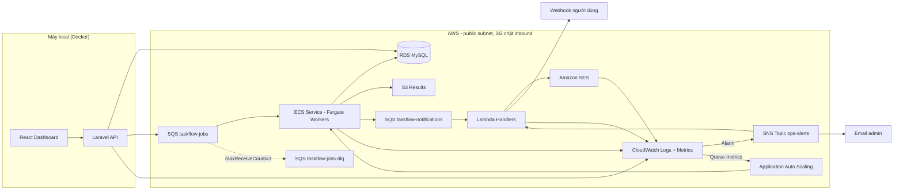
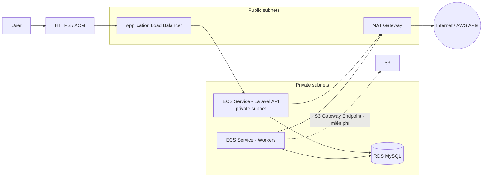
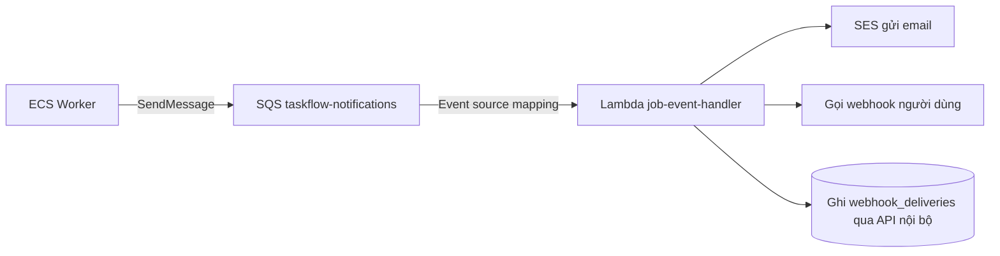
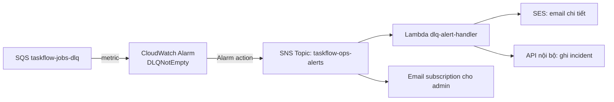
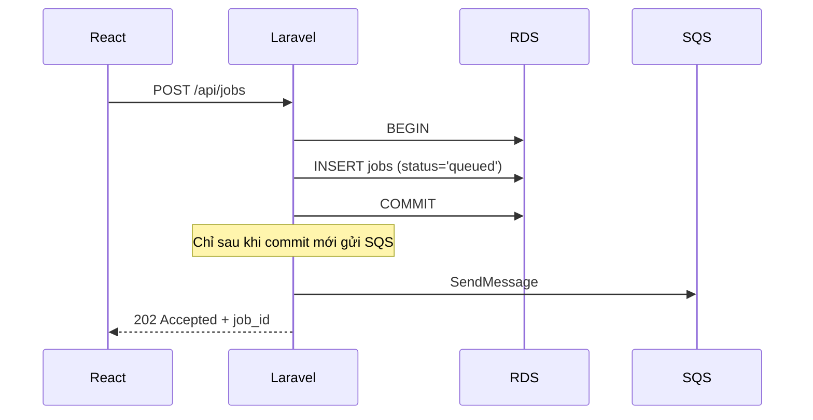
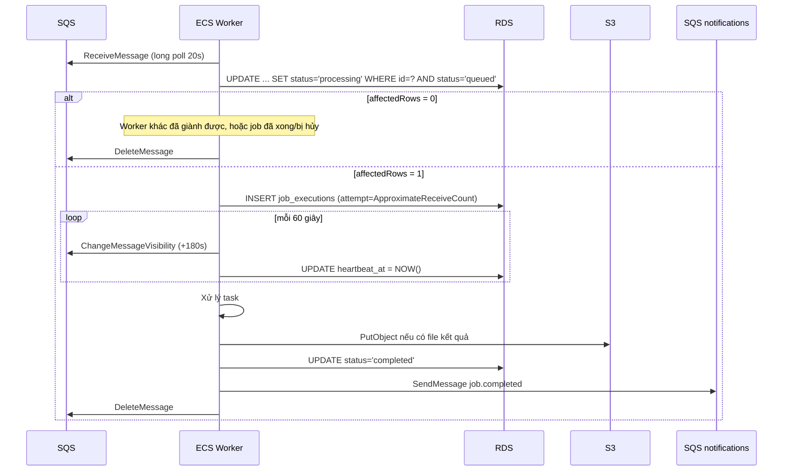
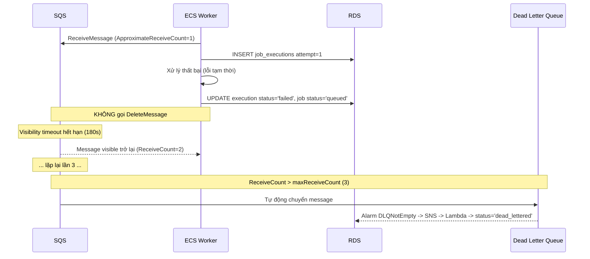

# UNIVERSAL JOB PROCESSING PLATFORM — TaskFlow Cloud
## Tài liệu thiết kế tổng quan

**Phiên bản:** 1.1
**Stack chính:** Laravel 10 (PHP 8.1), React + Vite, MySQL, Docker
**AWS trọng tâm:** SQS, ECS/Fargate, Lambda, SES, CloudWatch, Application Auto Scaling
**AWS đã biết và tiếp tục sử dụng:** EC2, RDS, S3
**Ngân sách:** $200 AWS credits, hết hạn **22/01/2027** — đây là ràng buộc thiết kế, không phải ghi chú phụ.

> **Thay đổi chính so với v1.0:** xem [Phụ lục A](#phụ-lục-a--changelog-v10--v11) ở cuối tài liệu.
>
> 📘 **Hướng dẫn triển khai từng bước:** [docs/plans/](plans/README.md) — tài liệu này trả lời "làm gì và vì sao", bộ đó trả lời "gõ gì, theo thứ tự nào".

---

# 0. Nguyên tắc chi phí (đọc trước tiên)

Toàn bộ thiết kế này bị chi phối bởi một con số: **$200 credits**. Kiến trúc "đúng chuẩn production" (NAT Gateway + ALB + RDS Multi-AZ) tốn khoảng **$71/tháng khi không làm gì cả** — nghĩa là credits hết trong chưa đầy 3 tháng, trong khi lộ trình học có 8 phase.

Vì vậy tài liệu này định nghĩa **hai chế độ triển khai**:

| | **Learning Mode** (Phase 1–7) | **Production-like Mode** (Phase 8) |
|---|---|---|
| Mạng | Public subnet + Security Group chặt | Private subnet + NAT Gateway |
| Laravel API | Chạy local (Docker) | ECS Fargate sau ALB + HTTPS |
| Database | Phase 1–2: MySQL local · Phase 3+: RDS single-AZ | RDS private subnet |
| Worker min tasks | 0 (bật lên khi load test) | 1–2 |
| Chi phí ước tính | **~$15–25/tháng** | **~$75/tháng** |

Phase 8 **không chạy thường trực**. Nó là một bài tập: dựng lên bằng Terraform, quan sát, chụp màn hình, viết ghi chú, rồi `terraform destroy`. Chi phí thực tế cho Phase 8 là vài đô cho 2–3 ngày.

## 0.1. Bảng giá tham khảo (us-east-1, xấp xỉ, chưa gồm data transfer)

| Thành phần | Đơn giá | Nếu chạy 24/7 |
|---|---|---:|
| NAT Gateway | $0.045/giờ + $0.045/GB | **~$32.4/tháng** |
| Application Load Balancer | $0.0225/giờ + LCU | **~$16.4/tháng** |
| RDS MySQL `db.t4g.micro` single-AZ | $0.016/giờ | ~$11.7/tháng |
| RDS storage gp3 20GB | $0.115/GB/tháng | ~$2.3/tháng |
| Fargate 0.25 vCPU / 512 MB | $0.01234/giờ/task | ~$9.0/tháng/task |
| Public IPv4 address | $0.005/giờ | ~$3.6/tháng/địa chỉ |
| VPC Interface Endpoint | $0.01/giờ/endpoint/AZ | ~$7.2/tháng/endpoint |
| S3 Gateway Endpoint | miễn phí | $0 |
| SQS | 1M request/tháng miễn phí, sau đó $0.40/M | ~$0 |
| Lambda | 1M request + 400k GB-s miễn phí vĩnh viễn | ~$0 |
| CloudWatch custom metric | $0.30/metric/tháng | xem 9.4 |
| CloudWatch Logs ingest | $0.50/GB | ~$1–3/tháng |
| CloudWatch Alarm (standard) | $0.10/alarm/tháng | ~$0.8/tháng |
| CloudWatch Dashboard | 3 dashboard đầu miễn phí, sau đó $3 | $0 |
| SNS | 1M publish miễn phí | ~$0 |
| ECR | $0.10/GB/tháng, 500MB miễn phí | ~$0.2/tháng |
| SSM Parameter Store (Standard) | miễn phí | $0 |
| Secrets Manager | $0.40/secret/tháng | tránh ở giai đoạn học |

## 0.2. Bốn quyết định tiết kiệm quan trọng nhất

**1. Không dùng NAT Gateway cho tới Phase 8.**
Fargate task đặt ở public subnet với `assignPublicIp=ENABLED`. Security Group **không mở inbound nào cả** — worker chỉ gọi ra ngoài (SQS, S3, SES, ECR, CloudWatch), không ai gọi vào. Về mặt an toàn thực tế điều này chấp nhận được cho môi trường học; về mặt chi phí nó rẻ hơn NAT khoảng 9 lần ($3.6 so với $32.4).

**2. VPC Interface Endpoint KHÔNG phải giải pháp rẻ hơn NAT.**
Đây là bẫy phổ biến. Để worker ở private subnet gọi được AWS API cần tối thiểu 4 interface endpoint (`sqs`, `ecr.api`, `ecr.dkr`, `logs`) ≈ **$28.8/tháng**, cộng thêm `sts`, `secretsmanager`, `email-smtp` nếu cần → đắt hơn NAT. Chỉ có **S3 Gateway Endpoint là miễn phí** và nên bật ngay từ đầu (Fargate pull image từ ECR cần S3).

**3. Không dùng ALB cho tới Phase 8.**
Phase 1–7 Laravel API chạy local trong Docker. Nó chỉ cần gọi ra SQS và RDS — không cần ở trong AWS để làm việc đó. React cũng chạy local. Bạn vẫn học được 100% về SQS/ECS/Lambda/SES/CloudWatch.

**4. `min tasks = 0` mặc định.**
Worker chỉ chạy khi bạn đang load test. Xem 6.4 để xử lý bẫy scale-to-zero.

## 0.3. Phase 0 — Cost Control (làm TRƯỚC khi tạo bất kỳ tài nguyên nào)

Phase bắt buộc, mất khoảng 45 phút. Chia làm 4 nhóm việc: IAM, Budgets, Tagging, Region.

### 0.3.1. Deadline thật của dự án

```text
Ngày bắt đầu     : 25/07/2026
Credits           : $200
Hạn dùng credits  : 22/01/2027   (181 ngày)
Ngân sách an toàn : $200 / 6 tháng ≈ $33/tháng
Dự toán thực tế   : $15–25/tháng  -> biên an toàn ~30%
```

Lịch dự kiến theo phase (điều chỉnh theo tốc độ thật của bạn):

| Tháng | Thời gian | Phase | Chi tiêu tích lũy dự kiến |
|---|---|---|---:|
| 1 | 07–08/2026 | 0, 1 (local) | ~$0 |
| 2 | 08–09/2026 | 2, 3 | ~$16 |
| 3 | 09–10/2026 | 4 | ~$40 |
| 4 | 10–11/2026 | 5, 6 | ~$60 |
| 5 | 11–12/2026 | 7 | ~$85 |
| 6 | 12/2026–01/2027 | 8 + tổng kết | ~$110 |
| — | **trước 22/01/2027** | **destroy toàn bộ** | |

Nếu tới cuối tháng 3 mà chi tiêu đã vượt $60, dừng lại soát hạ tầng — gần như chắc chắn có thứ gì đó đang chạy 24/7 mà bạn quên.

### 0.3.2. IAM — ba loại principal

Nguyên tắc: **không dùng root cho việc hằng ngày**. Lý do không phải least privilege, mà là root *không thể* bị giới hạn bởi bất kỳ policy nào, không revoke được theo kiểu thông thường, và có quyền đóng tài khoản.

| Principal | Quyền | Dùng khi nào |
|---|---|---|
| **Root** | không giới hạn được | Chỉ: billing preferences, đổi payment method, đổi support plan, đóng account |
| **`taskflow-admin`** (bạn) | `AdministratorAccess` + MFA + guardrail deny | Console và Terraform hằng ngày |
| **`taskflow-app-local`** | Chỉ `sqs:SendMessage` trên 1 queue | Access key cho Laravel chạy local (Phase 2–7), **xóa ở Phase 8** |

**Vì sao `taskflow-admin` là `AdministratorAccess` chứ không phải quyền hẹp:** bạn là người duy nhất trong account và cần tạo VPC, ECS, IAM role, RDS, Lambda, CloudWatch... Terraform còn cần `iam:CreateRole`, `iam:AttachRolePolicy`. Cắt quyền ở đây chỉ tạo ra hàng giờ debug `AccessDenied` thay vì học AWS. Least privilege áp dụng cho **service role** (ECS Task Role, Lambda Role — xem 14.1), không phải cho tài khoản người vận hành trong môi trường học một người.

**Bước làm:**

1. Bật MFA cho root, cất credentials root đi.
2. Tạo IAM user `taskflow-admin`, bật console access + MFA.
3. Attach `AdministratorAccess`.
4. Attach thêm 2 guardrail policy bên dưới (đây mới là phần đáng làm).
5. Tạo access key cho `taskflow-admin` để dùng với Terraform và AWS CLI.

> Lựa chọn tốt hơn nếu bạn muốn học thêm: **IAM Identity Center** (tên cũ AWS SSO) — miễn phí, cấp credentials tạm thời qua `aws sso login`, không có access key dài hạn nằm trên đĩa. Mất thêm ~15 phút cấu hình. Nếu có thời gian thì nên, nhưng IAM user + MFA đã đủ an toàn cho account học tập.

#### Guardrail 1 — Khóa region (quan trọng nhất)

Đây là cách mất tiền âm thầm phổ biến nhất: lỡ tay tạo resource ở region khác, không bao giờ mở console region đó ra nhìn, và nó chạy suốt 6 tháng.

```json
{
  "Version": "2012-10-17",
  "Statement": [{
    "Sid": "DenyOutsideAllowedRegions",
    "Effect": "Deny",
    "NotAction": [
      "iam:*", "sts:*", "organizations:*", "account:*",
      "cloudfront:*", "route53:*", "route53domains:*",
      "support:*", "budgets:*", "ce:*", "cur:*",
      "health:*", "globalaccelerator:*", "waf:*",
      "s3:ListAllMyBuckets", "s3:GetBucketLocation"
    ],
    "Resource": "*",
    "Condition": {
      "StringNotEquals": {
        "aws:RequestedRegion": ["ap-southeast-1", "us-east-1"]
      }
    }
  }]
}
```

`NotAction` liệt kê các dịch vụ **global** — chúng không có region nên phải loại trừ, nếu không bạn sẽ không tạo được cả IAM role.

Vì sao vẫn cho phép `us-east-1` dù chọn `ap-southeast-1`: metric `AWS/Billing` **chỉ tồn tại ở us-east-1**, nên alarm `BillingAlert` (9.6) bắt buộc phải tạo ở đó.

#### Guardrail 2 — Chặn dịch vụ đắt

```json
{
  "Version": "2012-10-17",
  "Statement": [
    {
      "Sid": "DenyExpensiveServices",
      "Effect": "Deny",
      "Action": [
        "eks:CreateCluster",
        "kafka:CreateCluster", "kafka:CreateClusterV2",
        "redshift:CreateCluster",
        "elasticmapreduce:RunJobFlow",
        "es:CreateDomain", "opensearch:CreateDomain",
        "sagemaker:CreateNotebookInstance", "sagemaker:CreateEndpoint",
        "fsx:CreateFileSystem",
        "directconnect:*",
        "network-firewall:CreateFirewall",
        "transfer:CreateServer",
        "route53domains:RegisterDomain",
        "elasticache:CreateCacheCluster",
        "elasticache:CreateReplicationGroup"
      ],
      "Resource": "*"
    },
    {
      "Sid": "OnlySmallInstances",
      "Effect": "Deny",
      "Action": "ec2:RunInstances",
      "Resource": "arn:aws:ec2:*:*:instance/*",
      "Condition": {
        "StringNotLike": {
          "ec2:InstanceType": ["t2.micro", "t3.micro", "t3.small", "t4g.micro", "t4g.small"]
        }
      }
    },
    {
      "Sid": "OnlySmallRds",
      "Effect": "Deny",
      "Action": ["rds:CreateDBInstance", "rds:ModifyDBInstance"],
      "Resource": "*",
      "Condition": {
        "StringNotLike": {
          "rds:DatabaseClass": ["db.t3.micro", "db.t4g.micro", "db.t4g.small"]
        }
      }
    }
  ]
}
```

Một EKS cluster là $73/tháng chỉ riêng control plane, MSK rẻ nhất cũng ~$80/tháng — hai cái đó thôi đã đủ xóa sổ credits. Chặn từ đầu rẻ hơn nhiều so với phát hiện sau.

> Guardrail chỉ áp lên IAM user, **không chặn được root**. Đó là một lý do nữa để không dùng root.

#### `taskflow-app-local` — access key cho Laravel local

Ở Learning Mode, Laravel chạy trên máy bạn nên bắt buộc phải có access key để gọi SQS. Cấp đúng quyền tối thiểu:

```json
{
  "Version": "2012-10-17",
  "Statement": [
    {
      "Effect": "Allow",
      "Action": ["sqs:SendMessage", "sqs:GetQueueUrl", "sqs:GetQueueAttributes"],
      "Resource": "arn:aws:sqs:ap-southeast-1:ACCOUNT_ID:taskflow-jobs"
    },
    {
      "Effect": "Allow",
      "Action": ["s3:GetObject", "s3:PutObject"],
      "Resource": "arn:aws:s3:::taskflow-results-*/*"
    }
  ]
}
```

Chú ý: user này **không có** `sqs:ReceiveMessage` và **không có** `sqs:DeleteMessage` — Laravel API chỉ gửi job, không bao giờ tiêu thụ. Worker dùng ECS Task Role riêng (14.1). Đây là least privilege thật, và nó cũng ngăn bạn vô tình viết code sai vai trò.

Key này để trong `.env` local, không commit, và **xóa khi sang Phase 8**.

### 0.3.3. AWS Budgets — cấu hình đúng

> **Cái bẫy phải biết trước:** AWS Budgets mặc định tính **chi phí SAU khi trừ credits**. Bạn đang có $200 credits, nên chi tiêu hiển thị sẽ là **$0** và budget **không bao giờ bắn** cho tới khi credits cạn sạch — đúng lúc quá muộn để làm gì.
>
> Khi tạo budget, vào **Advanced options** và **BỎ TICK "Credits"** (và "Refunds"). Khi đó budget theo dõi chi tiêu gộp, tức là tốc độ đốt credits thật. Đây là bước quan trọng nhất của cả mục 0.3.

**AWS chỉ miễn phí 2 budget/account** (từ cái thứ 3 tính ~$0.02/ngày). Nhưng **mỗi budget hỗ trợ tới 5 alert threshold**, nên 2 budget là quá đủ:

**Budget 1 — `taskflow-monthly-gross`**

```text
Type              : Cost budget
Period            : Monthly, recurring
Amount            : $30
Advanced options  : BỎ TICK Credits, Refunds
Filter            : (để trống — theo dõi toàn account, gồm cả thứ tạo ngoài dự án)
```

| Ngưỡng | Số tiền | Loại | Ý nghĩa |
|---:|---:|---|---|
| 10% | $3 | Actual | Bắt đầu có chi tiêu — bình thường ở Phase 3 |
| 30% | $9 | Actual | Đúng dự toán |
| 50% | $15 | Actual | Giới hạn trên của dự toán, để ý |
| 80% | $24 | Actual | Kiểm tra Cost Explorer ngay |
| 100% | $30 | Forecasted | Dự báo vượt — điều tra trong ngày |

**Budget 2 — `taskflow-total-credits`**

```text
Type    : Cost budget
Period  : Expiring (một lần), từ 25/07/2026 đến 22/01/2027
Amount  : $200
Alerts  : 25% ($50) · 50% ($100) · 75% ($150) · 90% ($180)
Advanced: BỎ TICK Credits
```

Budget này theo dõi **tổng credits đã đốt trong cả vòng đời dự án**, không reset mỗi tháng. Nó trả lời câu hỏi quan trọng nhất: "còn bao nhiêu credits để học tiếp?"

**Về con số $1/tháng bạn đang đặt:** dùng làm tripwire "có chi tiêu hay không" thì hợp lý trong Phase 0–2 (lúc đó đúng là gần $0). Nhưng từ Phase 3 trở đi bạn chi ~$15/tháng, budget $1 sẽ bắn liên tục mỗi ngày, bạn sẽ tắt thông báo, và thế là mất luôn tác dụng cảnh báo. Cảnh báo bắn quá nhiều thì tương đương không có cảnh báo. Đổi sang cấu trúc $30 + 5 ngưỡng ở trên: ngưỡng $3 vẫn cho bạn tín hiệu sớm y hệt $1, mà các ngưỡng cao hơn vẫn còn ý nghĩa khi hạ tầng đã lớn.

### 0.3.4. Các bước còn lại

3. **Cost Anomaly Detection** — tạo monitor kiểu "AWS services", alert về email khi lệch > $5. Miễn phí, phát hiện được thứ mà budget theo tháng bỏ sót (ví dụ một dịch vụ mới đột nhiên xuất hiện giữa tháng).
4. **Bật Cost Explorer** (Billing → Cost Explorer). Lần đầu bật mất tới 24 giờ mới có dữ liệu, nên làm ngay hôm nay.
5. **Tagging** — mọi resource phải có tag:
   ```
   Project     = taskflow
   Environment = learning | prod-like
   ManagedBy   = terraform | console
   ```
   Vào Billing → Cost Allocation Tags kích hoạt tag `Project`. Không có bước này thì Cost Explorer không tách được chi phí theo dự án. Tag mất **tối đa 24 giờ** mới có hiệu lực trong báo cáo, và **không hồi tố** — resource tạo trước khi bật tag sẽ không được phân loại. Đây là lý do phải làm ở Phase 0 chứ không phải sau.
   Trong Terraform, đặt ở `provider` để khỏi lặp lại:
   ```hcl
   provider "aws" {
     region = "ap-southeast-1"
     default_tags {
       tags = {
         Project     = "taskflow"
         Environment = "learning"
         ManagedBy   = "terraform"
       }
     }
   }
   ```
6. **Chọn 1 region duy nhất** và không bao giờ đổi. Đề xuất `ap-southeast-1` (Singapore, gần VN, latency thấp) hoặc `us-east-1` (rẻ nhất, đủ mọi dịch vụ). Tài liệu này dùng giá `us-east-1`; `ap-southeast-1` đắt hơn khoảng 10–20%. Đã chốt thì khóa lại bằng Guardrail 1 ở 0.3.2.
7. **Đặt lịch nhắc** kiểm tra Cost Explorer mỗi Chủ nhật, và một lịch nhắc **destroy Phase 8** đặt ngay khi bắt đầu phase đó.

### 0.3.5. Checklist Phase 0

- [ ] MFA trên root, cất credentials root
- [ ] IAM user `taskflow-admin` + MFA + `AdministratorAccess`
- [ ] Guardrail 1 (khóa region) attached
- [ ] Guardrail 2 (chặn dịch vụ đắt) attached
- [ ] Budget `taskflow-monthly-gross` $30, **đã bỏ tick Credits**, 5 ngưỡng
- [ ] Budget `taskflow-total-credits` $200, hết hạn 22/01/2027, **đã bỏ tick Credits**
- [ ] Cost Anomaly Detection bật
- [ ] Cost Explorer bật
- [ ] Cost Allocation Tag `Project` kích hoạt
- [ ] Region đã chốt: `________________`
- [ ] Lịch nhắc kiểm tra chi phí hằng tuần

## 0.4. Kỷ luật vận hành hằng ngày

```bash
# Kết thúc buổi học
./scripts/sleep.sh     # ECS desired=0, dừng RDS (tối đa 7 ngày), xóa scheduled rule
# Bắt đầu buổi học
./scripts/wake.sh
```

- **RDS có thể stop tối đa 7 ngày**, sau đó AWS tự start lại. Nếu nghỉ dài hơn: snapshot rồi delete instance (snapshot storage rất rẻ), khi quay lại thì restore.
- Từ Phase 3 trở đi mọi thứ nằm trong Terraform, nên `terraform destroy` cuối tuần là an toàn và dựng lại chỉ mất vài phút. Chỉ giữ lại state của những thứ có dữ liệu (RDS snapshot, S3 bucket).

## 0.5. Ngân sách dự kiến theo phase

| Phase | Nội dung | Chi phí ước tính |
|---|---|---:|
| 0 | Cost control, IAM | $0 |
| 1 | Local toàn bộ | $0 |
| 2 | SQS + DLQ, worker local | < $1 |
| 3 | ECR + ECS Fargate + RDS + Terraform | ~$15/tháng |
| 4 | Auto Scaling + load test | +$3–8 (Fargate lúc scale out) |
| 5 | SES sandbox | ~$0 |
| 6 | Lambda + SNS + EventBridge | ~$0 |
| 7 | CloudWatch đầy đủ | +$3–6/tháng |
| 8 | Production-like, chạy 2–3 ngày rồi destroy | ~$8 một lần |
| | **Tổng cho ~6 tháng học** | **~$100–130** |

Còn dư khoảng $70–100 làm biên an toàn cho sai sót. Biên này quan trọng — quên tắt một NAT Gateway trong 3 tuần là đã mất $22.

---

# 1. Mục tiêu dự án

Xây dựng một nền tảng cho phép người dùng tạo và theo dõi các tác vụ chạy nền như:

- Gửi email.
- Gọi API bên thứ ba.
- Đồng bộ dữ liệu.
- Tạo báo cáo.
- Xuất CSV hoặc PDF.
- Xử lý dữ liệu theo lô.
- Chạy các tác vụ giả lập tốn thời gian.
- Gửi webhook khi tác vụ hoàn thành.

Laravel đóng vai trò API và điều phối tác vụ. React cung cấp dashboard. Amazon SQS lưu hàng đợi. ECS/Fargate chạy các worker và tự động tăng hoặc giảm số lượng worker theo tải.

Dự án được thiết kế để học AWS thông qua một hệ thống thực tế, không nhằm xây dựng một sản phẩm thương mại hoàn chỉnh ngay từ đầu.

---

# 2. Phạm vi học tập

## 2.1. Dịch vụ trọng tâm

| Dịch vụ | Mục tiêu học | Ưu tiên |
|---|---|---|
| Amazon SQS | Queue, retry, visibility timeout, DLQ, message lifecycle, receipt handle | Cao |
| Amazon ECS | Chạy và quản lý container worker, task definition, service | Cao |
| AWS Fargate | Chạy container mà không tự quản lý EC2, SIGTERM lifecycle | Cao |
| Application Auto Scaling | Scale số lượng ECS task theo độ dài queue | Cao |
| Amazon CloudWatch | Logs, metrics, EMF, dashboard, alarms | Cao |
| Amazon SES | Gửi email và theo dõi delivery, bounce, complaint | Trung bình |
| AWS Lambda | Xử lý sự kiện và tác vụ ngắn — vai trò **phụ trợ**, không phải xương sống | Trung bình |

> Lưu ý điều chỉnh so với v1.0: trong kiến trúc này Lambda chỉ đóng vai phụ (event handler, cleanup). Đừng kỳ vọng học Lambda sâu ở đây — nếu muốn học Lambda làm compute chính thì đó là một dự án serverless khác.

## 2.2. Dịch vụ hỗ trợ

| Dịch vụ | Vai trò | Xuất hiện từ |
|---|---|---|
| Amazon RDS MySQL | Lưu user, job, execution và lịch sử | Phase 3 |
| Amazon S3 | Lưu file kết quả như CSV, PDF hoặc log lớn | Phase 3 |
| Amazon ECR | Lưu Docker image của Laravel và worker | Phase 3 |
| IAM | Phân quyền API, ECS task, Lambda và SES | Phase 0 |
| VPC | Mạng nội bộ cho ECS, RDS và các thành phần liên quan | Phase 3 |
| **Amazon SNS** | Cầu nối CloudWatch Alarm → Lambda (xem 7.2) | Phase 6 |
| SSM Parameter Store | Lưu config và secret (miễn phí, thay Secrets Manager) | Phase 3 |
| Terraform | Infrastructure as Code — **công cụ kiểm soát chi phí chính** | Phase 3 |
| Application Load Balancer | Nhận HTTP request cho Laravel API | **Chỉ Phase 8** |
| NAT Gateway | Cho private subnet ra Internet | **Chỉ Phase 8** |

---

# 3. Ý tưởng nghiệp vụ

Tên dự án:

> **TaskFlow Cloud**

Người dùng đăng nhập vào dashboard và tạo một job.

Ví dụ:

1. Chọn loại job `Generate Report`.
2. Nhập số lượng bản ghi cần xử lý.
3. Nhấn `Run`.
4. Laravel lưu job vào MySQL (`status = queued`) và **commit transaction**.
5. Laravel gửi message vào SQS **sau khi commit**.
6. ECS worker nhận message, giành quyền xử lý bằng compare-and-set.
7. Worker cập nhật tiến độ.
8. Khi hoàn thành, worker đẩy event vào queue `taskflow-notifications`.
9. Lambda tiêu thụ event → gửi email qua SES + gọi webhook.
10. React hiển thị trạng thái mới nhất (polling).
11. CloudWatch ghi nhận log, metric và cảnh báo lỗi.

---

# 4. Kiến trúc tổng quan

## 4.1. Learning Mode (Phase 1–7)



Điểm khác biệt quan trọng so với v1.0: **"Job Completed Event" nay có transport cụ thể** — queue `taskflow-notifications` (v1.0 khai báo queue này nhưng không dùng đến), và **CloudWatch Alarm đi qua SNS mới tới Lambda** (Alarm không invoke Lambda trực tiếp được — xem 7.2).

## 4.2. Production-like Mode (Phase 8)



Phase 8 chỉ dựng lên để quan sát và học, sau đó destroy. Xem 17.8.

---

# 5. Thành phần hệ thống

## 5.1. React Dashboard

React chỉ giao tiếp với Laravel API. Không truy cập trực tiếp SQS, ECS hoặc RDS.

Các màn hình chính:

- Đăng nhập.
- Danh sách job.
- Tạo job.
- Chi tiết job (bao gồm timeline các execution attempt).
- Lịch sử execution.
- Thống kê số job thành công và thất bại.
- Trang mô phỏng tải (Load Test).
- Trang quản trị dead-letter job.
- Trang xem trạng thái worker.
- Trang cấu hình email thông báo và webhook.

**Cập nhật trạng thái:** dùng polling `GET /api/jobs?status=processing` mỗi 3–5 giây. Không dùng WebSocket ở giai đoạn này (mục 19). Polling đủ tốt và không phát sinh hạ tầng.

**Authentication:** dùng **token-based** (Laravel Sanctum ở chế độ API token, không phải chế độ SPA cookie). Lý do: Sanctum SPA cookie yêu cầu frontend và backend cùng domain cha, ở Learning Mode chúng chạy hai port khác nhau trên local, tới Phase 8 lại đổi domain — token tránh được toàn bộ rắc rối CORS/CSRF đó. Token lưu trong memory + refresh, không lưu `localStorage` nếu tránh được.

---

## 5.2. Laravel API

Laravel chịu trách nhiệm:

- Authentication và authorization.
- Validate yêu cầu tạo job.
- Lưu job vào RDS.
- Gửi message vào SQS **sau khi transaction commit** (xem 11.1).
- Trả trạng thái job cho React.
- Cho phép retry job thất bại (tạo message mới, không phải "hồi sinh" message cũ).
- Đánh dấu job cancelled (xem 5.2.1).
- Quản lý webhook.
- Cấp pre-signed URL để tải file từ S3.
- Ghi structured log theo định dạng EMF khi cần metric (xem 9.4).

Laravel không xử lý tác vụ nặng trực tiếp trong HTTP request.

Ví dụ API:

```text
POST   /api/jobs
GET    /api/jobs
GET    /api/jobs/{id}
POST   /api/jobs/{id}/retry
POST   /api/jobs/{id}/cancel
GET    /api/dashboard/summary
POST   /api/load-tests
GET    /api/dlq                 # liệt kê job dead_lettered
POST   /api/dlq/{id}/redrive    # đẩy lại vào taskflow-jobs
```

### 5.2.1. Cancel job — giới hạn thật của SQS

**SQS không cho phép xóa một message cụ thể** khi bạn không đang giữ receipt handle của nó. Không có API kiểu `DeleteMessageById`. Vì vậy `POST /api/jobs/{id}/cancel` **không thể** gỡ message ra khỏi queue.

Cách làm đúng — cancel là một **cờ trong database**:

1. API set `jobs.cancel_requested = 1` (và `status = 'cancelling'` nếu job đang chạy, hoặc thẳng `cancelled` nếu còn `queued`).
2. Worker khi nhận message: đọc job, nếu `cancel_requested = 1` → set `status = 'cancelled'`, **xóa message**, thoát. Không xử lý gì.
3. Với job dài, worker kiểm tra lại cờ này định kỳ (ví dụ mỗi 5 giây hoặc mỗi 10% tiến độ) và dừng sớm nếu được yêu cầu.

Nghĩa là cancel có độ trễ — job đang chạy sẽ dừng ở checkpoint gần nhất, job đang nằm trong queue sẽ bị bỏ qua khi tới lượt. Điều này phải nói rõ với người dùng trên UI ("Cancellation requested").

---

## 5.3. Amazon SQS

SQS là trung tâm điều phối asynchronous job.

Queue:

```text
taskflow-jobs             # job cần worker xử lý
taskflow-jobs-dlq         # message thất bại quá maxReceiveCount
taskflow-notifications    # event job.completed / job.failed cho Lambda
taskflow-notifications-dlq
```

### 5.3.1. Message contract — `taskflow-jobs`

```json
{
  "message_version": 1,
  "job_id": "01JABCXYZ",
  "job_type": "generate_report",
  "priority": "normal",
  "payload": {
    "record_count": 10000,
    "format": "csv"
  },
  "requested_by": 123,
  "created_at": "2026-07-25T08:00:00+07:00"
}
```

Message chỉ chứa dữ liệu đủ để **tìm** job trong database và biết phải làm gì. Không nhét file, không nhét payload lớn (giới hạn SQS là 256 KB). Nguồn sự thật luôn là bảng `jobs`.

`message_version` cho phép thay đổi contract về sau mà worker cũ vẫn nhận diện được và từ chối một cách tường minh.

### 5.3.2. Message contract — `taskflow-notifications`

```json
{
  "message_version": 1,
  "event": "job.completed",
  "job_id": "01JABCXYZ",
  "execution_id": "01JEXECXYZ",
  "user_id": 123,
  "occurred_at": "2026-07-25T08:04:12+07:00"
}
```

`event` nhận một trong: `job.completed`, `job.failed`, `job.dead_lettered`.

### 5.3.3. Cấu hình queue

```text
taskflow-jobs
  Visibility timeout      : 180 giây
  Message retention       : 4 ngày
  Receive wait time       : 20 giây      # long polling — giảm số request, rẻ hơn
  Redrive policy          : maxReceiveCount = 3 -> taskflow-jobs-dlq

taskflow-jobs-dlq
  Message retention       : 14 ngày      # tối đa, để có thời gian điều tra

taskflow-notifications
  Visibility timeout      : 60 giây      # >= 6x Lambda timeout (AWS khuyến nghị)
  Redrive policy          : maxReceiveCount = 3 -> taskflow-notifications-dlq
```

**Long polling (`ReceiveMessageWaitTimeSeconds = 20`) là bắt buộc**, không phải tùy chọn: short polling khiến worker gọi `ReceiveMessage` liên tục, vừa tốn request vừa vô nghĩa. Với long polling, 1 worker rảnh chỉ tốn ~3 request/phút.

### 5.3.4. Visibility timeout

Visibility timeout phải **lớn hơn** thời gian xử lý dự kiến của worker, và worker timeout phải **nhỏ hơn** visibility timeout:

```text
Job timeout của worker      : 150 giây
Visibility timeout của queue: 180 giây      # dư 30 giây biên an toàn
```

> **Sửa lỗi v1.0:** v1.0 đặt cả hai bằng 180 giây. Khi bằng nhau, đúng lúc worker sắp xong thì message đã visible trở lại và worker thứ hai nhận cùng job — tạo ra duplicate không cần thiết. Luôn để worker bỏ cuộc **trước** khi message quay lại.

Với job dài hơn 150 giây, worker chủ động gọi `ChangeMessageVisibility` để gia hạn (heartbeat mỗi 60 giây, gia hạn thêm 180 giây). Xem 5.4.3.

Worker chỉ gọi `DeleteMessage` **sau khi** đã xử lý xong và cập nhật trạng thái thành công vào database.

---

## 5.4. ECS/Fargate Worker

### 5.4.1. Quyết định quan trọng: viết consumer riêng, không dùng `queue:work sqs`

> **Đây là sửa lỗi lớn nhất của v1.1.**

v1.0 đề xuất chạy `php artisan queue:work sqs --queue=taskflow-jobs`. **Cách này không hoạt động với message contract ở 5.3.1**, vì hai lý do độc lập nhau:

**Vấn đề 1 — format không khớp.** Laravel SQS driver kỳ vọng message body là payload do chính Laravel serialize:

```json
{
  "uuid": "...",
  "displayName": "App\\Jobs\\ProcessJob",
  "job": "Illuminate\\Queue\\CallQueuedHandler@call",
  "data": { "commandName": "App\\Jobs\\ProcessJob", "command": "O:19:\"App\\Jobs\\...\":..." }
}
```

Đưa JSON tự định nghĩa vào, `queue:work sqs` sẽ ném exception chứ không xử lý. Message contract ở 5.3.1 và `queue:work sqs` loại trừ lẫn nhau.

**Vấn đề 2 — `--tries=1` phá vỡ toàn bộ luồng DLQ.** v1.0 khẳng định `--tries=1` không ảnh hưởng vì "SQS redrive policy kiểm soát số lần retry". Điều này **sai**: với `tries=1`, khi job ném exception, Laravel đánh dấu job failed, ghi vào bảng `failed_jobs`, rồi **gọi `DeleteMessage`**. Message biến mất khỏi SQS, `ReceiveCount` không bao giờ chạm 3, và **không bao giờ có message nào vào DLQ**. Toàn bộ Phase 2 ("kiểm tra retry và DLQ") sẽ không quan sát được gì.

**Vấn đề 3 — không gia hạn được visibility timeout.** Laravel queue worker không có cơ chế heartbeat `ChangeMessageVisibility` cho job dài. Yêu cầu ở 5.3.4 không thực hiện được.

**Quyết định:** viết một Artisan command riêng dùng trực tiếp AWS SDK for PHP:

```bash
php artisan taskflow:consume --queue=taskflow-jobs --max-messages=10 --idle-timeout=0
```

Đánh đổi: viết thêm ~200 dòng code. Đổi lại bạn **thật sự học được SQS** — receipt handle, visibility, redrive, long polling, batch delete — thay vì để Laravel giấu hết đi. Với một dự án có mục tiêu học AWS, đây là đánh đổi đúng.

### 5.4.2. Khung consumer

```php
// app/Console/Commands/ConsumeQueue.php  (rút gọn)
$sqs = new SqsClient([...]);

while (! $this->shouldStop) {
    $result = $sqs->receiveMessage([
        'QueueUrl'              => $queueUrl,
        'MaxNumberOfMessages'   => 1,
        'WaitTimeSeconds'       => 20,   // long polling
        'VisibilityTimeout'     => 180,
        'AttributeNames'        => ['ApproximateReceiveCount'],
    ]);

    foreach ($result['Messages'] ?? [] as $message) {
        $receipt = $message['ReceiptHandle'];
        $body    = json_decode($message['Body'], true);
        $attempt = (int) $message['Attributes']['ApproximateReceiveCount'];

        try {
            $outcome = $this->handler->handle($body, $attempt, $receipt);

            if ($outcome->shouldDelete()) {
                $sqs->deleteMessage(['QueueUrl' => $queueUrl, 'ReceiptHandle' => $receipt]);
            }
        } catch (NonRetryableException $e) {
            // Lỗi vĩnh viễn: ghi nhận, đánh dấu failed, XÓA message.
            // Không để SQS retry thứ chắc chắn sẽ hỏng lại.
            $this->markFailed($body['job_id'], $e, retryable: false);
            $sqs->deleteMessage(['QueueUrl' => $queueUrl, 'ReceiptHandle' => $receipt]);
        } catch (Throwable $e) {
            // Lỗi tạm thời: KHÔNG xóa message.
            // Message tự visible lại sau visibility timeout.
            // Sau maxReceiveCount = 3 lần, SQS tự chuyển sang DLQ.
            $this->markFailed($body['job_id'], $e, retryable: true);
            $this->backoff($sqs, $queueUrl, $receipt, $attempt);  // xem 13.3
        }
    }
}
```

Nguyên tắc cốt lõi, ngắn gọn: **thành công → delete. Lỗi vĩnh viễn → delete. Lỗi tạm thời → không delete.** Chỉ vậy là DLQ hoạt động đúng như mô tả ở 11.3.

### 5.4.3. Heartbeat cho job dài

```php
// Trong lúc xử lý job dài, mỗi 60 giây:
$sqs->changeMessageVisibility([
    'QueueUrl'          => $queueUrl,
    'ReceiptHandle'     => $receipt,
    'VisibilityTimeout' => 180,   // đặt lại thành 180s tính từ bây giờ
]);
```

Trong Laravel có thể chạy heartbeat bằng `pcntl_alarm` hoặc kiểm tra thời gian trong vòng lặp xử lý. Cần giới hạn tổng thời gian (ví dụ tối đa 15 phút) để job treo không kéo dài vô hạn — quá hạn thì ném exception và để SQS redrive.

### 5.4.4. Graceful shutdown (SIGTERM) — bắt buộc với auto scaling

> **Bổ sung mới ở v1.1.** Thiếu phần này thì Phase 4 sẽ liên tục sinh job lỗi giả mà không hiểu tại sao.

Khi ECS scale in hoặc deploy phiên bản mới, nó gửi **`SIGTERM`** cho container, chờ `stopTimeout` giây, rồi `SIGKILL`. Mặc định `stopTimeout` chỉ **30 giây** — job 60 giây của bạn sẽ bị giết giữa chừng.

Worker phải xử lý như sau:

```php
pcntl_async_signals(true);
pcntl_signal(SIGTERM, function () {
    $this->shouldStop = true;          // ngừng nhận message MỚI
    Log::info('SIGTERM received, draining');
});
```

Và trong task definition:

```json
{
  "stopTimeout": 120,
  "essential": true
}
```

Luồng shutdown đúng:

1. Nhận `SIGTERM` → đặt cờ, **ngừng gọi `receiveMessage`**.
2. Xử lý nốt message đang cầm trên tay.
3. Nếu ước tính không kịp trong `stopTimeout`: gọi `changeMessageVisibility(VisibilityTimeout: 0)` để **trả message về queue ngay lập tức** — worker khác nhận trong vài giây thay vì chờ hết 180 giây.
4. Thoát với exit code 0.

`stopTimeout` tối đa là 120 giây (Fargate). Nếu job của bạn dài hơn thế thì bắt buộc phải dùng cách (3) — trả message về queue.

Đây là phần trực tiếp phục vụ mục tiêu học Auto Scaling: scale-in mà không mất job.

### 5.4.5. ECS resources

```text
CPU:            0.25 vCPU
Memory:         512 MB
Minimum tasks:  0        # mặc định — xem bẫy scale-to-zero ở 6.4
Desired tasks:  0
Maximum tasks:  10
stopTimeout:    120 giây
Platform:       LINUX/ARM64      # Graviton, rẻ hơn ~20% so với X86_64
```

**Dùng ARM64/Graviton**: Fargate ARM rẻ hơn khoảng 20% so với x86 với cùng hiệu năng cho workload PHP. Build image bằng `docker buildx build --platform linux/arm64`. Nếu bạn dev trên Mac Apple Silicon thì đây còn là kiến trúc native, build nhanh hơn.

**Tại sao min = 0:** một task chạy 24/7 tốn ~$9/tháng, tức ~$54 cho 6 tháng — hơn 25% ngân sách, chỉ để ngồi chờ. Trong giai đoạn học, bật worker lên khi cần bằng `./scripts/wake.sh`. Nếu bạn thấy khó quan sát thì có thể để min = 1 trong đúng buổi làm Phase 3–4 rồi hạ về 0.

---

# 6. Auto Scaling theo SQS

Không scale worker theo CPU. Worker chờ I/O là chính; CPU thấp trong khi queue đầy là chuyện bình thường, scale theo CPU sẽ không phản ứng.

Metric đúng:

```text
Backlog per task = ApproximateNumberOfMessagesVisible / RunningTaskCount
```

## 6.1. Chọn giá trị target

Công thức:

```text
Acceptable backlog per task = (Độ trễ chấp nhận được) / (Thời gian xử lý trung bình 1 message)
```

Ví dụ với thiết kế này:

```text
Job trung bình      : 15 giây
Độ trễ chấp nhận    : 5 phút = 300 giây
Target backlog/task = 300 / 15 = 20 messages/task
```

Tình huống minh họa:

| Queue visible | Running task | Backlog/task | Hành động |
|---:|---:|---:|---|
| 0 | 1 | 0 | Scale in về 0 |
| 20 | 1 | 20 | Giữ nguyên (đúng target) |
| 100 | 1 | 100 | Scale out mạnh |
| 100 | 5 | 20 | Giữ nguyên |
| 10 | 5 | 2 | Scale in |

## 6.2. Phase 4a — Step scaling (làm trước, dễ quan sát)

```text
Queue 0          -> 0 task
Queue 1-10       -> 1 task
Queue 11-50      -> 2 tasks
Queue 51-200     -> 5 tasks
Queue > 200      -> 10 tasks
```

Step scaling minh bạch và dễ debug — bạn nhìn alarm nào bắn là biết ngay tại sao. Làm cái này trước.

## 6.3. Phase 4b — Target tracking với metric math

```json
{
  "Metrics": [
    { "Id": "visible", "MetricStat": { "Metric": { "Namespace": "AWS/SQS", "MetricName": "ApproximateNumberOfMessagesVisible", "Dimensions": [{"Name":"QueueName","Value":"taskflow-jobs"}] }, "Stat": "Average" }, "ReturnData": false },
    { "Id": "tasks",   "MetricStat": { "Metric": { "Namespace": "ECS/ContainerInsights", "MetricName": "RunningTaskCount", "Dimensions": [{"Name":"ClusterName","Value":"taskflow"},{"Name":"ServiceName","Value":"taskflow-worker"}] }, "Stat": "Average" }, "ReturnData": false },
    { "Id": "backlog", "Expression": "IF(tasks > 0, visible / tasks, visible)", "ReturnData": true }
  ]
}
```

**Chú ý dòng `IF(tasks > 0, ...)`** — xem 6.4.

> Lưu ý chi phí: `RunningTaskCount` nằm trong namespace `ECS/ContainerInsights`, cần **bật Container Insights** cho cluster. Container Insights tính phí theo custom metric (khoảng $1–3/tháng ở quy mô này với 1 cluster / 1 service). Chấp nhận được, nhưng nhớ tắt khi không dùng. Nếu muốn miễn phí tuyệt đối: tự publish `RunningTaskCount` bằng Lambda + EventBridge Scheduler mỗi phút — nhưng đó là công sức không đáng ở giai đoạn này.

## 6.4. Bẫy scale-to-zero — phải xử lý

> **Bổ sung mới ở v1.1.** Đây là lỗi khiến rất nhiều người bỏ cuộc ở Phase 4.

Khi `min = 0` và service đang ở 0 task:

```
backlog = visible / RunningTaskCount = 100 / 0 = không xác định
```

Metric math trả về giá trị không hợp lệ, target tracking **không có dữ liệu để hành động**, và service **mãi mãi kẹt ở 0 task dù queue đầy**.

Hai cách xử lý, nên làm cả hai:

**Cách 1 — biểu thức phòng thủ** (đã có ở 6.3):
```
IF(tasks > 0, visible / tasks, visible)
```
Khi tasks = 0, backlog = visible. Nếu visible ≥ 1 thì nó đã vượt target 20 → scale out. Nhưng nếu chỉ có 1–19 message thì vẫn dưới target và vẫn kẹt ở 0.

**Cách 2 — alarm riêng cho bước 0 → 1** (bắt buộc):

```text
Alarm : WakeUpWorker
Metric: ApproximateNumberOfMessagesVisible >= 1
Period: 60 giây, 1 datapoint
Action: Step scaling policy — đặt desired = 1
```

Kết hợp: alarm `WakeUpWorker` lo bước 0 → 1, target tracking lo 1 → N và N → 1, và một scale-in policy đưa về 0 khi queue rỗng liên tục 5 phút.

## 6.5. Cooldown

```text
Scale-out cooldown: 60 giây
Scale-in cooldown : 300 giây
```

Scale-out nhanh để queue không dồn. Scale-in chậm (tăng từ 180 lên 300 so với v1.0) vì Fargate tính phí theo giây với tối thiểu 1 phút — thà giữ task thêm vài phút còn hơn liên tục tạo/hủy task (mỗi lần cold start mất 30–60 giây).

## 6.6. Kỳ vọng thực tế khi load test

Điều quan trọng cần biết trước để không tưởng là hệ thống hỏng:

- **`ApproximateNumberOfMessagesVisible` phát ra mỗi 60 giây**, không realtime.
- Alarm cần ít nhất 1–2 datapoint → **1–2 phút**.
- Fargate task từ lúc quyết định scale tới lúc bắt đầu poll message: **30–90 giây** (pull image, khởi động).
- **Tổng độ trễ từ lúc queue tăng tới lúc worker mới xử lý: khoảng 2–4 phút.**

Vì vậy **load test phải kéo dài ít nhất 10–15 phút**, không phải 30 giây. Test 30 giây thì queue đã cạn trước khi task đầu tiên kịp khởi động, và bạn sẽ kết luận nhầm là auto scaling không chạy. Xem 16.

---

# 7. Vai trò của Lambda

Lambda **không** thay thế ECS worker. Nó xử lý tác vụ ngắn, stateless, kích hoạt bởi event. Với free tier 1M request/tháng vĩnh viễn, phần này gần như miễn phí.

## 7.1. Job Event Handler

**Trigger:** SQS event source mapping từ `taskflow-notifications`.



Luồng:

1. Worker hoàn thành job → `SendMessage` vào `taskflow-notifications`.
2. Lambda được kích hoạt (batch size 5, `maxBatchingWindow` 10 giây để gom bớt).
3. Lambda gửi email qua SES.
4. Lambda gọi webhook nếu người dùng đã cấu hình.
5. Lambda ghi log EMF để tạo custom metric.

**Vì sao dùng SQS chứ không EventBridge:** SQS đã có sẵn trong kiến trúc, có sẵn DLQ, có sẵn retry, và bạn đã học nó ở Phase 2. EventBridge để dành cho mục 20 khi thật sự cần fan-out nhiều consumer. Ít công nghệ hơn ở giai đoạn đầu là tốt hơn.

**Cấu hình:**
```text
Timeout        : 10 giây
Memory         : 256 MB
Batch size     : 5
Reserved concurrency: 5      # chặn Lambda spam SES vượt rate limit sandbox
```

`Reserved concurrency = 5` quan trọng: SES sandbox chỉ cho 1 message/giây. Không giới hạn concurrency thì Lambda scale ra 100 instance và bị SES throttle hàng loạt.

## 7.2. DLQ Alert Handler — sửa lỗi kiến trúc

> **Sửa lỗi v1.0.** v1.0 viết "CloudWatch Alarm hoặc event kích hoạt Lambda". **CloudWatch Alarm không invoke Lambda trực tiếp được.** Alarm action chỉ hỗ trợ: SNS topic, EC2 action, Auto Scaling action, Systems Manager action. Không có Lambda trong danh sách này.

Kiến trúc đúng:



Có hai lựa chọn, dùng SNS là đơn giản nhất:

- **`Alarm → SNS → Lambda`** (khuyến nghị): SNS gần như miễn phí, đồng thời cho phép subscribe thêm email admin trực tiếp mà không cần code.
- **`Alarm → EventBridge rule (CloudWatch Alarm State Change) → Lambda`**: linh hoạt hơn nhưng phức tạp hơn, không cần ở giai đoạn này.

Lambda `dlq-alert-handler` làm gì:

1. Đọc alarm payload từ SNS message.
2. Gọi `ReceiveMessage` trên DLQ (không xóa) để lấy vài mẫu message lỗi.
3. Đối chiếu database để lấy `error_message` gần nhất của các job đó.
4. Gửi một email tổng hợp qua SES (một email, không phải mỗi job một email).
5. Đánh dấu các job liên quan thành `dead_lettered` trong database.

## 7.3. Scheduled Maintenance

**Trigger:** EventBridge Scheduler, mỗi 5 phút cho việc quan trọng, mỗi ngày cho việc dọn dẹp.

Mỗi 5 phút:

- **Phát hiện job mồ côi** (quan trọng — xem 11.1): job có `status = 'queued'` nhưng `created_at` cách đây hơn 10 phút và không có `job_executions` nào → message có thể đã mất khi gửi SQS thất bại → **gửi lại message**.
- **Phát hiện job treo**: `status = 'processing'` nhưng `heartbeat_at` cũ hơn 5 phút → worker đã chết giữa chừng → đánh dấu `failed` với `error_code = 'worker_lost'`.

Mỗi ngày:

- Xóa `job_executions` cũ hơn 30 ngày.
- Xóa file S3 kết quả cũ hơn 7 ngày (hoặc dùng S3 Lifecycle Rule — miễn phí và không cần code, nên ưu tiên).
- Tổng hợp thống kê trong ngày vào bảng summary.

> Mẹo chi phí: dùng **S3 Lifecycle Rule** thay vì Lambda để xóa file cũ. Không tốn tiền, không tốn code, không thể hỏng.

---

# 8. Amazon SES

## 8.1. Giới hạn sandbox — cần kỳ vọng thực tế

> **Bổ sung quan trọng ở v1.1.**

Tài khoản SES mới luôn ở **sandbox**:

- Chỉ gửi được tới **địa chỉ email đã verify**.
- Tối đa **200 email/24 giờ**.
- Tối đa **1 message/giây**.

Và: **yêu cầu production access cho dự án học tập rất hay bị từ chối.** AWS muốn thấy use case thật, danh sách người nhận có thật, quy trình xử lý bounce/complaint. Đừng xây kế hoạch dựa trên việc chắc chắn được duyệt.

**Kế hoạch thực tế:**

1. Ở nguyên sandbox. Verify 2–3 địa chỉ email cá nhân của bạn.
2. **Trong load test, TẮT email hoàn toàn** hoặc chỉ gửi **1 email tổng hợp cho cả batch**. Load test 1.000 job × 1 email = vượt hạn mức 200/ngày ngay lập tức và bị SES throttle. Thêm cờ:
   ```json
   { "job_type": "simulate_work", "payload": { "notify": false } }
   ```
3. `Reserved concurrency = 5` trên Lambda (xem 7.1) để không vượt 1 msg/giây.
4. Vẫn học được đầy đủ về Configuration Set, event publishing, bounce/complaint handling — sandbox không giới hạn những thứ đó. Dùng **SES simulator address** để test bounce/complaint mà không ảnh hưởng reputation:
   ```
   bounce@simulator.amazonses.com
   complaint@simulator.amazonses.com
   success@simulator.amazonses.com
   ```
   Đây là cách đúng để test Phase 5 — không cần production access, không hại reputation.

## 8.2. Email nghiệp vụ

- Job đã hoàn thành (chỉ khi `notify = true`).
- Job thất bại.
- Báo cáo đã sẵn sàng (kèm pre-signed URL).
- Webhook gọi thất bại.
- Job bị chuyển vào DLQ.

## 8.3. Email vận hành (gửi cho admin qua SNS subscription)

- Queue backlog quá cao.
- Worker không hoạt động trong khi có queue.
- Tỷ lệ job thất bại tăng.
- SES bounce rate hoặc complaint rate vượt ngưỡng.

## 8.4. Event cần theo dõi

Send · Delivery · Bounce · Complaint · Reject · Delivery delay · Rendering failure.

Tạo **SES Configuration Set** với event destination xuất sang **CloudWatch** (rẻ, đủ dùng) hoặc SNS nếu cần xử lý bằng code.

---

# 9. CloudWatch

CloudWatch là phần bắt buộc của project, không chỉ là nơi xem log. Nhưng nó cũng là **dịch vụ dễ gây sốc hóa đơn nhất** — đọc kỹ 9.4.

## 9.1. Log groups

```text
/taskflow/laravel-api
/taskflow/ecs-worker
/taskflow/lambda/job-event-handler
/taskflow/lambda/dlq-alert
/taskflow/lambda/maintenance
```

**Đặt retention cho MỌI log group** — mặc định là "Never expire" và bạn sẽ trả tiền lưu trữ mãi mãi:

```text
Retention: 7 ngày   (giai đoạn học)
```

Đây là một dòng trong Terraform, quên là mất tiền âm thầm.

## 9.2. Structured logging

Mỗi log là một dòng JSON:

```json
{
  "level": "info",
  "service": "ecs-worker",
  "job_id": "01JABCXYZ",
  "job_type": "generate_report",
  "execution_id": "01JEXECXYZ",
  "attempt": 1,
  "duration_ms": 25340,
  "status": "completed"
}
```

Không ghi access token, password, secret key hoặc payload nhạy cảm vào log.

## 9.3. Metrics cần theo dõi

**SQS** (miễn phí, có sẵn): `ApproximateNumberOfMessagesVisible`, `ApproximateNumberOfMessagesNotVisible`, `ApproximateAgeOfOldestMessage`, `NumberOfMessagesSent`, `NumberOfMessagesReceived`, `NumberOfMessagesDeleted`.

**ECS**: `RunningTaskCount`, `CPUUtilization`, `MemoryUtilization`, task start/stop events (qua EventBridge).

**Application** (custom — xem cảnh báo chi phí bên dưới): `JobSuccessCount`, `JobFailureCount`, `JobDuration`, `JobRetryCount`, `WebhookFailureCount`.

**SES**: Send, Delivery, Bounce, Complaint, Reject.

## 9.4. Cảnh báo chi phí custom metrics — đọc kỹ

> **Bổ sung quan trọng ở v1.1.**

CloudWatch tính **$0.30/metric/tháng**, và **mỗi tổ hợp dimension là một metric riêng biệt**.

Ví dụ nguy hiểm: 5 application metric × 8 `job_type` × 6 `status` = **240 metric = $72/tháng**. Nhiều hơn toàn bộ phần còn lại của hạ tầng cộng lại, và đủ để đốt hết 1/3 credits trong một tháng.

**Quy tắc bắt buộc cho dự án này:**

1. **Tối đa 1 dimension** cho custom metric, và chỉ dùng `job_type` với tối đa 5 giá trị. Không bao giờ đặt `job_id`, `user_id`, `execution_id` làm dimension — cardinality vô hạn.
2. **Dùng Embedded Metric Format (EMF)** thay vì gọi `PutMetricData`. EMF nhúng metric vào log line, CloudWatch tự trích xuất. Bạn trả tiền log ingest ($0.50/GB) thay vì trả cho từng API call, và code đơn giản hơn:

```json
{
  "_aws": {
    "Timestamp": 1753420800000,
    "CloudWatchMetrics": [{
      "Namespace": "TaskFlow",
      "Dimensions": [["JobType"]],
      "Metrics": [
        { "Name": "JobDuration", "Unit": "Milliseconds" },
        { "Name": "JobSuccessCount", "Unit": "Count" }
      ]
    }]
  },
  "JobType": "generate_report",
  "JobDuration": 25340,
  "JobSuccessCount": 1,
  "job_id": "01JABCXYZ"
}
```

`job_id` vẫn có trong log để tra cứu, nhưng **không nằm trong `Dimensions`** nên không sinh metric. Đây chính xác là điều bạn muốn.

3. **CloudWatch Logs Insights** để truy vấn ad-hoc thay vì tạo thêm metric. Trả tiền theo lượng dữ liệu quét ($0.005/GB), rẻ hơn nhiều so với giữ metric thường trực.
4. **Container Insights**: bật khi làm Phase 4 (cần `RunningTaskCount`), tắt khi không dùng.

## 9.5. Dashboard

Một dashboard duy nhất tên `taskflow` (3 dashboard đầu miễn phí):

1. Queue depth (visible + not visible).
2. Tuổi của message lâu nhất.
3. Số ECS task đang chạy — **đặt cạnh queue depth để thấy tương quan scaling**.
4. CPU và memory worker.
5. Job thành công / thất bại.
6. Thời gian xử lý trung bình và p95.
7. Số message trong DLQ.
8. SES delivery / bounce / complaint rate.

Widget số 1 và 3 đặt chồng lên nhau trên cùng một biểu đồ là widget giá trị nhất của cả dashboard — nó cho bạn thấy trực quan auto scaling đang phản ứng thế nào.

## 9.6. Alarms

| Alarm | Điều kiện | Action |
|---|---|---|
| `WakeUpWorker` | Visible messages >= 1, 1 datapoint / 60s | Step scaling: desired = 1 |
| `QueueBacklogHigh` | Visible messages > 200 trong 5 phút | SNS ops-alerts |
| `OldMessageDetected` | `ApproximateAgeOfOldestMessage` > 300 giây | SNS ops-alerts |
| `DLQNotEmpty` | DLQ visible messages >= 1 | SNS → Lambda dlq-alert |
| `WorkerMemoryHigh` | Memory > 85% trong 5 phút | SNS ops-alerts |
| `JobFailureRateHigh` | Failure rate > 10% (metric math) | SNS ops-alerts |
| `NoWorkerRunning` | RunningTasks = 0 **và** queue > 0 trong 5 phút | SNS ops-alerts |
| `SESBounceHigh` | Bounce rate > 5% | SNS ops-alerts |
| `SESComplaintHigh` | Complaint rate > 0.1% | SNS ops-alerts |
| **`BillingAlert`** | EstimatedCharges > $25 | SNS ops-alerts |

Với mọi alarm, đặt `TreatMissingData` cho phù hợp — khi worker ở 0 task thì nhiều metric sẽ không có dữ liệu, và mặc định `missing` có thể khiến alarm bắn nhầm liên tục.

`BillingAlert` chỉ có ở `us-east-1` (metric `AWS/Billing` chỉ tồn tại ở region này) — tạo alarm ở đó kể cả khi bạn triển khai ở region khác.

Các ngưỡng trên là giá trị khởi đầu, hiệu chỉnh sau khi có dữ liệu thực tế.

---

# 10. Thiết kế dữ liệu

## 10.1. Bảng `jobs`

```text
id                  BIGINT PK
ulid                CHAR(26) UNIQUE      -- dùng trong message, log, URL
user_id             BIGINT FK
type                VARCHAR(50)
status              VARCHAR(20)
priority            VARCHAR(10)
payload_json        JSON
progress            TINYINT UNSIGNED     -- 0..100
result_json         JSON NULL
result_s3_key       VARCHAR(512) NULL
cancel_requested    BOOLEAN DEFAULT 0    -- xem 5.2.1
heartbeat_at        TIMESTAMP NULL       -- xem 7.3, phát hiện worker chết
error_code          VARCHAR(50) NULL
error_message       TEXT NULL
attempts            TINYINT DEFAULT 0
notify              BOOLEAN DEFAULT 1    -- tắt khi load test, xem 8.1
created_at
queued_at
started_at
completed_at
failed_at

INDEX (status, created_at)               -- cho maintenance Lambda
INDEX (user_id, created_at)              -- cho danh sách job
```

Status:

```text
queued          -- đã ghi DB và đã gửi SQS
processing      -- worker đang giữ
completed
failed          -- lỗi vĩnh viễn, không retry
cancelling      -- người dùng yêu cầu hủy, worker chưa dừng
cancelled
dead_lettered   -- vào DLQ sau 3 lần
```

> **Bỏ `pending`** so với v1.0. Lý do: v1.0 dùng `pending → gửi SQS → queued`, tạo cửa sổ race condition (xem 11.1). Nay job được insert thẳng với `queued` trong transaction, SQS gửi sau khi commit. Không còn trạng thái trung gian.

Ba trường mới quan trọng: `cancel_requested` (5.2.1), `heartbeat_at` (phát hiện worker chết), `notify` (bảo vệ hạn mức SES).

## 10.2. Bảng `job_executions`

```text
id                  BIGINT PK
job_id              BIGINT FK
attempt             TINYINT              -- lấy từ ApproximateReceiveCount của SQS
worker_id           VARCHAR(100)         -- hostname container
ecs_task_arn        VARCHAR(255) NULL
sqs_receipt_handle  TEXT NULL            -- để debug
status              VARCHAR(20)
started_at
finished_at
duration_ms         INT NULL
error_code          VARCHAR(50) NULL
error_message       TEXT NULL
metadata_json       JSON NULL

UNIQUE (job_id, attempt)                 -- chống ghi trùng khi message duplicate
```

`UNIQUE (job_id, attempt)` là một lớp phòng thủ idempotency ở tầng database: nếu SQS giao trùng cùng một lần nhận, insert thứ hai sẽ fail và worker biết ngay là mình đang xử lý trùng.

## 10.3. Bảng `webhooks`

```text
id, user_id, name, url, secret, is_active, events_json, created_at, updated_at
```

## 10.4. Bảng `webhook_deliveries`

```text
id
webhook_id
job_id
event
idempotency_key     VARCHAR(255) UNIQUE  -- xem mục 12
status
http_status         SMALLINT NULL
attempt             TINYINT
request_body        TEXT
response_body       TEXT NULL
sent_at             TIMESTAMP NULL
created_at
```

`idempotency_key UNIQUE` là cơ chế chống gửi webhook trùng, không phải chỉ là ghi chú.

## 10.5. Migration chạy ở đâu

Không chạy migration trong entrypoint của API container — nhiều task khởi động cùng lúc sẽ chạy đua với nhau.

Cách đúng: **one-off ECS task**.

```bash
aws ecs run-task \
  --cluster taskflow \
  --task-definition taskflow-migrate \
  --launch-type FARGATE \
  --network-configuration "awsvpcConfiguration={subnets=[...],securityGroups=[...],assignPublicIp=ENABLED}" \
  --overrides '{"containerOverrides":[{"name":"app","command":["php","artisan","migrate","--force"]}]}'
```

Đưa lệnh này vào `scripts/migrate.sh`. Ở Learning Mode, khi Laravel API còn chạy local và RDS còn cho phép kết nối từ IP của bạn, chạy `php artisan migrate` từ local cũng được — đơn giản hơn nhiều.

---

# 11. Luồng xử lý job

## 11.1. Tạo job — xử lý dual-write

> **Sửa lỗi v1.0.** v1.0 làm: `Insert pending → Send SQS → Update queued`. Vấn đề thật: nếu transaction chưa commit mà message đã tới worker (SQS rất nhanh, thường < 100ms), worker query database sẽ **không thấy job** và ném lỗi "job không tồn tại". Đây là race condition xảy ra thường xuyên chứ không phải hiếm.

Thứ tự đúng:



Trong Laravel:

```php
$job = DB::transaction(fn () => Job::create([...'status' => 'queued']));

// DB::afterCommit đảm bảo chỉ chạy sau khi transaction ngoài cùng commit
DB::afterCommit(fn () => $this->queue->send($job->toMessage()));
```

**Trường hợp lỗi còn lại:** DB commit thành công nhưng `SendMessage` thất bại (network, throttle). Job kẹt ở `queued` vĩnh viễn, không ai xử lý.

Xử lý: **Maintenance Lambda (7.3) quét mỗi 5 phút** tìm job `status = 'queued'`, `created_at < now() - 10 phút`, không có `job_executions` nào → gửi lại message. Đây chính là lý do Lambda ở 7.3 tồn tại, không phải chỉ để "dọn dẹp cho có".

Nếu về sau muốn giải quyết triệt để: **transactional outbox pattern** (ghi message vào bảng `outbox` trong cùng transaction, một process riêng đọc và gửi). Ghi vào mục 20 — chưa cần bây giờ, nhưng nên biết tên nó.

## 11.2. Worker xử lý



Thứ tự cuối rất quan trọng: **cập nhật database trước, gửi notification, rồi mới xóa message.** Nếu worker chết sau khi update DB nhưng trước khi delete, message quay lại → worker mới thấy `status = 'completed'` → xóa message và bỏ qua. An toàn.

## 11.3. Job thất bại và DLQ



Điều làm luồng này hoạt động là **không gọi `DeleteMessage` khi gặp lỗi tạm thời** — chính là điều mà `queue:work sqs --tries=1` phá vỡ (xem 5.4.1).

Với lỗi vĩnh viễn (payload sai, job type không tồn tại) thì ngược lại: **delete ngay**, đánh dấu `failed`. Không có lý do gì retry 3 lần một thứ chắc chắn hỏng — vừa tốn 9 phút vừa làm nhiễu DLQ.

---

# 12. Idempotency

SQS Standard Queue có thể giao một message **nhiều hơn một lần**. Đây không phải trường hợp hiếm cần phòng xa — nó xảy ra thật, và cả khi worker bị SIGKILL giữa chừng nữa. Worker bắt buộc phải idempotent.

## 12.1. Compare-and-set — cơ chế chính

> **Cụ thể hóa so với v1.0.** v1.0 nói "nếu job đang được worker khác xử lý, không xử lý trùng" nhưng không nói bằng cách nào.

Một câu SQL duy nhất, atomic, không cần Redis, không cần `SELECT ... FOR UPDATE`:

```sql
UPDATE jobs
SET    status = 'processing',
       started_at = COALESCE(started_at, NOW()),
       heartbeat_at = NOW(),
       attempts = attempts + 1
WHERE  id = :job_id
  AND  status IN ('queued', 'processing')
  AND  (status <> 'processing' OR heartbeat_at < NOW() - INTERVAL 5 MINUTE)
  AND  cancel_requested = 0;
```

Rồi kiểm tra số dòng bị ảnh hưởng:

```php
$claimed = DB::update($sql, ['job_id' => $jobId]);

if ($claimed === 0) {
    // Không giành được. Ba khả năng:
    //   - job đã completed  -> xóa message, xong
    //   - worker khác đang giữ và còn sống -> xóa message, để nó làm
    //   - cancel_requested  -> set cancelled, xóa message
    $this->resolveUnclaimed($jobId);
    return Outcome::delete();
}
```

`affectedRows` là kết quả atomic của MySQL — không có cửa sổ race giữa đọc và ghi. Điều kiện `heartbeat_at < NOW() - INTERVAL 5 MINUTE` cho phép **giành lại job từ một worker đã chết**, đúng như mục 19 nói: "Redis nếu database lock đã đủ" — ở đây database lock là đủ thật.

## 12.2. Idempotency cho side effect

Mọi thao tác có tác dụng phụ ra bên ngoài (SES, webhook) phải có idempotency key:

```text
job:{job_id}:attempt:{attempt}:{operation}
```

Ví dụ: `job:01JABCXYZ:attempt:2:webhook:5`

Với webhook: **INSERT bản ghi `webhook_deliveries` với `idempotency_key UNIQUE` TRƯỚC khi gửi**. Nếu insert bị duplicate key → đã gửi rồi → bỏ qua. Ghi trước, gửi sau — không bao giờ ngược lại.

Với SES: dùng cùng nguyên tắc, hoặc tận dụng `notify` flag và trạng thái `completed` để tránh gửi lại.

## 12.3. Checklist worker idempotent

Trước khi xử lý, theo đúng thứ tự:

1. Đọc job từ database theo `job_id`.
2. Nếu không tồn tại → có thể transaction chưa commit → **không xóa message**, để nó retry (Maintenance Lambda sẽ dọn nếu thật sự mồ côi).
3. Nếu `status = 'completed'` → xóa message, thoát.
4. Nếu `cancel_requested = 1` → set `cancelled`, xóa message, thoát.
5. Thực hiện compare-and-set (12.1). `affectedRows = 0` → xóa message, thoát.
6. Xử lý. Mọi side effect dùng idempotency key.

---

# 13. Retry và lỗi

## 13.1. Lỗi có thể retry (không xóa message)

- API bên thứ ba timeout.
- HTTP 429 (rate limit).
- HTTP 5xx.
- Database connection tạm thời lỗi / deadlock.
- Network interruption.
- S3 / SQS throttling.

## 13.2. Lỗi không nên retry (xóa message ngay, đánh dấu `failed`)

- Payload không hợp lệ / thiếu trường bắt buộc.
- `job_type` không tồn tại.
- `message_version` không được hỗ trợ.
- User không có quyền.
- Tài nguyên tham chiếu đã bị xóa.
- HTTP 4xx (trừ 429) từ API bên thứ ba.

Cài đặt bằng hai lớp exception: `RetryableException` và `NonRetryableException`. Mọi exception không xác định được → mặc định coi là retryable (an toàn hơn).

## 13.3. Backoff

SQS không có exponential backoff tự động. Worker chủ động điều chỉnh visibility timeout của message trước khi thả nó ra:

```php
protected function backoff(SqsClient $sqs, string $url, string $receipt, int $attempt): void
{
    $delay = match ($attempt) {
        1       => 30,    // 30 giây
        2       => 120,   // 2 phút
        default => 300,   // 5 phút
    };

    $sqs->changeMessageVisibility([
        'QueueUrl'          => $url,
        'ReceiptHandle'     => $receipt,
        'VisibilityTimeout' => $delay,
    ]);
}
```

Message sẽ visible trở lại sau `$delay` giây thay vì 180 giây mặc định. `ApproximateReceiveCount` vẫn tăng, nên redrive sang DLQ vẫn hoạt động bình thường.

Lưu ý: `VisibilityTimeout` tối đa là 12 giờ, và `changeMessageVisibility` **đặt lại** giá trị tính từ thời điểm gọi (không cộng dồn).

## 13.4. Retry thủ công từ UI

`POST /api/jobs/{id}/retry` **không** hồi sinh message cũ (không làm được). Nó:

1. Reset `status = 'queued'`, `cancel_requested = 0`, xóa `error_*`.
2. Gửi một message **mới** vào `taskflow-jobs`.
3. `job_executions` cũ giữ nguyên làm lịch sử, execution mới có `attempt` tiếp theo.

Tương tự với redrive từ DLQ (`POST /api/dlq/{id}/redrive`). AWS cũng có tính năng **DLQ redrive** sẵn trong console — nên thử một lần bằng console ở Phase 2 để hiểu, rồi mới tự implement.

---

# 14. Bảo mật

## 14.1. IAM Role

Không lưu `AWS_ACCESS_KEY_ID` / `AWS_SECRET_ACCESS_KEY` trong container.

- **ECS Task Execution Role** — pull image từ ECR, ghi CloudWatch Logs, đọc SSM parameter.
- **ECS Task Role** — quyền của ứng dụng: SQS, S3, SES.
- **Lambda Execution Role** — riêng cho từng Lambda.
- Least privilege: giới hạn theo ARN cụ thể, không dùng `Resource: "*"`.

Ví dụ Task Role cho worker:

```json
{
  "Version": "2012-10-17",
  "Statement": [
    {
      "Effect": "Allow",
      "Action": [
        "sqs:ReceiveMessage", "sqs:DeleteMessage",
        "sqs:ChangeMessageVisibility", "sqs:GetQueueAttributes"
      ],
      "Resource": "arn:aws:sqs:REGION:ACCOUNT:taskflow-jobs"
    },
    {
      "Effect": "Allow",
      "Action": "sqs:SendMessage",
      "Resource": "arn:aws:sqs:REGION:ACCOUNT:taskflow-notifications"
    },
    {
      "Effect": "Allow",
      "Action": ["s3:PutObject", "s3:GetObject"],
      "Resource": "arn:aws:s3:::taskflow-results-*/*"
    }
  ]
}
```

Chú ý worker **không có** quyền `sqs:SendMessage` lên `taskflow-jobs` — nó chỉ tiêu thụ. Chỉ Laravel API mới được gửi. Đây là least privilege thực tế, không phải hình thức.

Ở Learning Mode, Laravel chạy local nên **cần** một IAM user với access key để gọi SQS. Chấp nhận được, nhưng: chỉ cấp quyền `sqs:SendMessage` + `sqs:GetQueueAttributes`, đặt trong `.env` local, không commit, và xóa access key khi sang Phase 8.

## 14.2. Network

**Learning Mode (Phase 1–7):**

- Fargate task ở **public subnet**, `assignPublicIp = ENABLED`.
- Security Group của worker: **không có inbound rule nào**, outbound cho phép 443.
- RDS ở public subnet, `publicly_accessible = true`, Security Group chỉ cho phép port 3306 từ **IP tĩnh của bạn** và từ Security Group của worker.
- **S3 Gateway Endpoint** bật ngay (miễn phí, giảm data transfer cho ECR image pull).

Đây là đánh đổi có ý thức: tiết kiệm $32/tháng NAT Gateway, đổi lại RDS lộ ra Internet nhưng được SG khóa theo IP. Không đặt dữ liệu thật vào đây.

**Production-like Mode (Phase 8):**

- RDS ở private subnet, `publicly_accessible = false`.
- ECS ở private subnet, ra Internet qua NAT Gateway.
- Laravel API sau ALB, HTTPS bằng ACM certificate.
- Security Group của RDS chỉ nhận từ SG của API và SG của worker (tham chiếu theo SG ID, không phải CIDR).
- Không mở port database ra Internet.

## 14.3. Secrets

Dùng **AWS Systems Manager Parameter Store (Standard tier) — miễn phí**, kiểu `SecureString`:

```text
/taskflow/prod/DB_PASSWORD
/taskflow/prod/APP_KEY
/taskflow/prod/WEBHOOK_SIGNING_KEY
```

ECS inject trực tiếp qua `secrets` trong task definition — không cần code đọc:

```json
"secrets": [
  { "name": "DB_PASSWORD", "valueFrom": "arn:aws:ssm:REGION:ACCOUNT:parameter/taskflow/prod/DB_PASSWORD" }
]
```

> **Không dùng Secrets Manager ở giai đoạn học**: $0.40/secret/tháng × 5 secret × 6 tháng = $12 cho thứ mà Parameter Store làm miễn phí. Secrets Manager chỉ đáng tiền khi cần automatic rotation — ghi vào mục 20 để thử một lần ở Phase 8 rồi xóa.

Không commit `.env` lên Git.

---

# 15. Docker và ECR

## 15.1. Image

```text
taskflow-api      # php-fpm + nginx
taskflow-worker   # php CLI, entrypoint là consumer command
```

Cùng source Laravel, khác entrypoint:

```dockerfile
# Dockerfile.worker
FROM php:8.1-cli-alpine
# ... cài extension: pdo_mysql, bcmath, pcntl (BẮT BUỘC cho SIGTERM), opcache
CMD ["php", "artisan", "taskflow:consume", "--queue=taskflow-jobs"]
```

**`pcntl` là extension bắt buộc** — không có nó thì không xử lý được SIGTERM (5.4.4) và worker sẽ luôn bị giết ngang khi scale in.

Build cho ARM64 (rẻ hơn 20%, xem 5.4.5):

```bash
docker buildx build --platform linux/arm64 -f backend/Dockerfile.worker -t taskflow-worker .
```

## 15.2. ECR

Đặt **Lifecycle Policy** ngay khi tạo repository:

```json
{
  "rules": [{
    "rulePriority": 1,
    "description": "Chỉ giữ 5 image gần nhất",
    "selection": { "tagStatus": "any", "countType": "imageCountMoreThan", "countNumber": 5 },
    "action": { "type": "expire" }
  }]
}
```

Image Laravel khoảng 150–300 MB. Không có lifecycle policy, sau 50 lần build là 10 GB = $1/tháng và tăng dần mãi mãi. Nhỏ nhưng là loại rò rỉ chi phí điển hình mà bạn nên tập nhận diện.

## 15.3. Pipeline

```text
Git push
  -> Build image (ARM64)
  -> Push ECR với tag = git SHA (không dùng :latest)
  -> Register ECS task definition revision mới
  -> Update ECS service
```

Tag bằng git SHA để rollback được. `:latest` khiến bạn không biết đang chạy phiên bản nào.

CI/CD (GitHub Actions + OIDC role, không dùng access key) bổ sung ở Phase 8.

---

# 16. Mô phỏng tải

Để quan sát Auto Scaling, hệ thống cần chức năng tạo tải có kiểm soát.

Trang `Load Test`:

- Số lượng job: 10, 100, 500, 1.000.
- Thời gian xử lý mỗi job: 5–30 giây.
- Tỷ lệ lỗi giả lập: 0%, 5%, 20%.
- Loại lỗi: retryable / non-retryable.
- Loại job và priority.
- **Gửi email: bật/tắt** (mặc định TẮT — xem 8.1).

Payload:

```json
{
  "job_type": "simulate_work",
  "notify": false,
  "payload": {
    "duration_seconds": 15,
    "failure_probability": 0.05,
    "failure_type": "retryable"
  }
}
```

## 16.1. Thiết kế bài test có ý nghĩa

> **Bổ sung ở v1.1.** Đây là chỗ dễ kết luận sai nhất.

Như đã nói ở 6.6, độ trễ từ khi queue tăng đến khi worker mới xử lý là **2–4 phút**. Vì vậy:

**Bài test SAI:** 100 job × 5 giây, xong trong 30 giây. Queue cạn trước khi task thứ hai kịp khởi động. Kết luận sai: "auto scaling không hoạt động".

**Bài test ĐÚNG:**

```text
Test A — Scale out cơ bản
  500 job × 20 giây = ~2.8 giờ công việc cho 1 worker
  Quan sát trong 20 phút:
    - Queue depth tăng vọt lên 500
    - Alarm WakeUpWorker bắn -> 0 -> 1 task
    - Target tracking đẩy lên 5-10 task trong 5-8 phút
    - Queue depth giảm dần
    - ApproximateAgeOfOldestMessage tăng rồi giảm

Test B — Scale in
  Sau khi Test A xử lý hết, ngồi yên 15 phút
    - Quan sát scale in từng bước (cooldown 300s)
    - Kiểm tra không có job nào bị mất khi task bị dừng (SIGTERM handling)

Test C — DLQ
  20 job với failure_probability = 1.0, failure_type = retryable
    - Mỗi job phải bị nhận đúng 3 lần (kiểm tra job_executions)
    - Sau ~9-12 phút, cả 20 message nằm trong DLQ
    - Alarm DLQNotEmpty -> SNS -> Lambda -> 1 email tổng hợp
    - Job status = dead_lettered

Test D — Idempotency
  Kill một Fargate task thủ công giữa lúc đang xử lý
    (aws ecs stop-task)
    - Message quay lại queue
    - Worker khác nhận, thấy heartbeat cũ, giành lại job
    - Job hoàn thành đúng MỘT lần (kiểm tra webhook_deliveries)

Test E — Non-retryable
  10 job với failure_type = non-retryable
    - Mỗi job chỉ có ĐÚNG 1 execution
    - Không job nào vào DLQ
    - status = failed
```

Test D và E là hai bài quan trọng nhất — chúng kiểm chứng những phần v1.0 nói đúng về lý thuyết nhưng cấu hình sai về thực hành.

## 16.2. Chi phí một buổi load test

500 job × 20 giây ≈ 2.8 giờ-task. Với 10 task chạy song song ~20 phút: 10 × 0.33 giờ × $0.01234 ≈ **$0.04**. Rẻ hơn nhiều so với việc để 1 task chạy không 24/7. Cứ test thoải mái — thứ đắt là hạ tầng nằm chờ, không phải hạ tầng làm việc.

---

# 17. Các giai đoạn triển khai

## Phase 0 — Cost Control · $0
Xem mục 0.3. **Không bỏ qua phase này.**

## Phase 1 — Local · $0

- Laravel API + React Dashboard + MySQL trong Docker Compose.
- **Định nghĩa interface `JobQueue`** với 2 implementation:
  ```php
  interface JobQueue {
      public function send(JobMessage $message): void;
      public function receive(int $waitSeconds): ?ReceivedMessage;
      public function delete(ReceivedMessage $message): void;
      public function changeVisibility(ReceivedMessage $message, int $seconds): void;
  }
  ```
  `DatabaseJobQueue` (Phase 1) và `SqsJobQueue` (Phase 2). Sang Phase 2 chỉ đổi binding trong Service Provider, business logic không sửa một dòng.
- Ba loại job giả lập: `simulate_work`, `generate_report`, `send_email`.
- Consumer command `taskflow:consume` viết luôn ở đây, chạy với `DatabaseJobQueue`.
- Trang danh sách, chi tiết, load test.

**Kết quả:** Luồng nghiệp vụ chạy hoàn chỉnh, chưa tốn một xu AWS. Đây là phase dài nhất và nên làm kỹ nhất — mọi lỗi logic phát hiện ở đây đều miễn phí.

## Phase 2 — SQS · < $1

- Tạo `taskflow-jobs`, `taskflow-jobs-dlq`, redrive policy `maxReceiveCount = 3`.
- Cài `SqsJobQueue` bằng AWS SDK, đổi binding.
- Worker vẫn chạy **local** nhưng consume SQS **thật**.
- Thí nghiệm bắt buộc (làm bằng tay, quan sát trên console):
  - Nhận message rồi không xóa → xem nó visible lại sau 180 giây.
  - Cho job fail 3 lần → xem nó tự vào DLQ.
  - Dùng **DLQ redrive trong console** để đẩy ngược lại.
  - `ChangeMessageVisibility` giữa lúc xử lý → xem `ApproximateNumberOfMessagesNotVisible` thay đổi.
  - Gửi 2 message giống hệt → kiểm chứng compare-and-set (12.1) chỉ cho 1 cái đi qua.

**Kết quả:** Hiểu vòng đời message SQS ở mức thao tác tay, không qua abstraction.

## Phase 3 — ECR, ECS/Fargate, RDS, Terraform · ~$15/tháng

- **Viết Terraform ngay từ phase này** — không click console nữa.
  > **Thay đổi so với v1.0** (v1.0 để IaC tận Phase 8). Lý do: khả năng `terraform destroy` và dựng lại trong 3 phút là **công cụ kiểm soát chi phí quan trọng nhất** của bạn. Hạ tầng click tay thì không ai dám xóa vì sợ dựng lại mất cả buổi — và đó chính là cách credits bốc hơi.
- Terraform module: `vpc`, `sqs`, `ecr`, `ecs`, `rds`, `iam`.
- Build image ARM64, push ECR (nhớ lifecycle policy).
- RDS `db.t4g.micro`, single-AZ, public subnet + SG theo IP (Learning Mode).
- ECS cluster, task definition (`stopTimeout = 120`), service với `desired = 1`.
- Log driver `awslogs`, retention 7 ngày.
- Cuối buổi: `terraform destroy` và **dựng lại từ đầu để chứng minh nó thật sự lặp lại được**.

**Kết quả:** Worker chạy trên Fargate, và bạn có nút tắt/bật toàn bộ hạ tầng.

## Phase 4 — Auto Scaling · +$3–8

- Bật Container Insights.
- Scalable target: min 0, max 10.
- 4a: step scaling theo queue depth (6.2).
- 4b: target tracking backlog-per-task với metric math (6.3).
- **Alarm `WakeUpWorker`** cho bước 0 → 1 (6.4) — không có cái này thì min=0 sẽ kẹt.
- Implement SIGTERM handling (5.4.4).
- Chạy Test A, B, D ở 16.1.

**Kết quả:** Worker tăng giảm theo tải và không mất job khi scale in.

## Phase 5 — SES · ~$0

- Verify 2–3 email cá nhân (sandbox).
- Configuration Set + event destination sang CloudWatch.
- Gửi email job hoàn thành.
- **Test bounce/complaint bằng SES simulator address** (8.1) — không cần production access.
- Hiển thị delivery status trên dashboard.

**Kết quả:** Có notification và hiểu bounce/complaint handling.

## Phase 6 — Lambda + SNS · ~$0

- Queue `taskflow-notifications` + DLQ.
- Lambda `job-event-handler` (SQS event source mapping, reserved concurrency 5).
- SNS topic `taskflow-ops-alerts` + email subscription.
- Lambda `dlq-alert-handler` (**Alarm → SNS → Lambda**, không phải Alarm → Lambda).
- Lambda `maintenance` (EventBridge Scheduler, 5 phút + hằng ngày), bao gồm phát hiện job mồ côi (11.1).
- IAM role riêng cho từng Lambda.

**Kết quả:** Hiểu vai trò event-driven của Lambda bên cạnh ECS, và tại sao cần SNS ở giữa.

## Phase 7 — CloudWatch hoàn chỉnh · +$3–6/tháng

- Structured logs JSON toàn hệ thống.
- Custom metrics bằng **EMF**, tối đa 1 dimension (9.4).
- Dashboard `taskflow` với queue depth chồng lên running tasks.
- Toàn bộ alarms ở 9.6, gồm `BillingAlert`.
- CloudWatch Logs Insights: viết sẵn 3–5 query hay dùng, lưu lại.
- Diễn tập sự cố: kill worker, làm ngập DLQ, chặn RDS — xem alarm nào bắn và bao lâu.

**Kết quả:** Monitoring và alerting end-to-end, và kiểm chứng được chi phí metric không vượt tầm kiểm soát.

## Phase 8 — Production-like · ~$8 (chạy 2–3 ngày rồi destroy)

> **Phase này CÓ THỜI HẠN.** Đặt lịch nhắc destroy sau 3 ngày ngay khi bắt đầu.

- Terraform workspace riêng (`prod-like`), tách hoàn toàn khỏi `learning`.
- Private subnet + NAT Gateway (~$32/tháng — chạy 3 ngày là $3.2).
- Laravel API lên ECS Fargate sau ALB.
- ACM certificate + HTTPS.
- RDS private, `publicly_accessible = false`.
- SSM Parameter Store cho secrets.
- CI/CD GitHub Actions + OIDC.
- RDS automated backup.
- Cost dashboard, so sánh chi phí Learning vs Production-like.
- **Chụp màn hình, viết ghi chú, rồi `terraform destroy`.**

**Kết quả:** Hiểu chênh lệch chi phí và độ phức tạp giữa hai mô hình — bài học có giá trị nhất của cả dự án, mà chỉ tốn khoảng $8.

---

# 18. Tiêu chí hoàn thành

Dự án đạt mục tiêu học tập khi chứng minh được:

**Nghiệp vụ**
- [ ] Laravel tạo job và gửi message vào SQS **sau khi transaction commit**.
- [ ] ECS worker trên Fargate nhận và xử lý message.
- [ ] Message chỉ bị xóa sau khi job thành công (hoặc lỗi vĩnh viễn).
- [ ] Job lỗi tạm thời được retry đúng 3 lần rồi vào DLQ.
- [ ] Job lỗi vĩnh viễn chỉ chạy 1 lần, không vào DLQ.
- [ ] Cancel job hoạt động cho cả job đang queue và đang chạy.
- [ ] Dashboard React hiển thị trạng thái, tiến độ và lịch sử execution.

**Độ tin cậy**
- [ ] Worker xử lý an toàn khi nhận message trùng (compare-and-set).
- [ ] Kill task giữa chừng → job vẫn hoàn thành đúng một lần, không mất, không trùng.
- [ ] Scale in không làm mất job đang xử lý (SIGTERM handling).
- [ ] Job mồ côi (`queued` quá lâu) được Maintenance Lambda phát hiện và gửi lại.

**Scaling**
- [ ] Số ECS task tăng khi backlog tăng, từ 0 lên N.
- [ ] Số ECS task giảm về 0 khi queue rỗng.
- [ ] Giải thích được vì sao dùng backlog-per-task chứ không phải CPU.
- [ ] Giải thích được bẫy chia-cho-0 khi scale-to-zero và cách khắc phục.

**Observability**
- [ ] CloudWatch hiển thị logs có cấu trúc và custom metrics qua EMF.
- [ ] Alarm phát hiện ít nhất 3 tình huống lỗi thật (đã diễn tập, không phải chỉ cấu hình).
- [ ] Alarm → SNS → Lambda hoạt động (hiểu vì sao không nối thẳng Alarm → Lambda).
- [ ] SES gửi email và ghi nhận delivery/bounce event.

**Chi phí — tiêu chí mới, quan trọng ngang phần kỹ thuật**
- [ ] Tổng chi tiêu thực tế < $130 cho toàn bộ dự án.
- [ ] Không có tháng nào vượt $30.
- [ ] `terraform destroy` và dựng lại được toàn bộ hạ tầng trong dưới 10 phút.
- [ ] Giải thích được thành phần nào đắt nhất và vì sao.
- [ ] Custom metrics < 30 metric.

---

# 19. Những phần không cần làm ngay

- Kubernetes hoặc EKS (control plane $73/tháng — tuyệt đối không).
- Multi-region, multi-account.
- Kafka hoặc Amazon MSK (rẻ nhất cũng ~$80/tháng).
- AWS Step Functions.
- GraphQL.
- Microservices quá nhỏ.
- Redis / ElastiCache — database lock ở 12.1 đã đủ.
- WebSocket realtime — polling 3–5 giây là đủ.
- NAT Gateway trước Phase 8.
- ALB trước Phase 8.
- Secrets Manager — Parameter Store miễn phí và đủ dùng.
- RDS Multi-AZ (gấp đôi giá, không học thêm được gì ở giai đoạn này).
- Scale Laravel API trước khi worker scaling hoạt động.
- FIFO Queue khi chưa có yêu cầu ordering rõ ràng.
- CloudFront (chưa có traffic thật).
- AWS WAF ($5/tháng + per-rule, chưa cần).

---

# 20. Hướng mở rộng

Sau khi hoàn thành phiên bản chính:

- Queue theo priority (`taskflow-jobs-high` / `-normal`), worker poll high trước.
- Tách worker theo job type với ECS service riêng, scaling độc lập.
- **Transactional outbox** để giải quyết triệt để dual-write (11.1).
- Scheduled Job bằng EventBridge Scheduler.
- Step Functions cho workflow nhiều bước.
- EventBridge để fan-out event tới nhiều consumer.
- DynamoDB cho idempotency key (on-demand, gần như miễn phí ở scale nhỏ).
- API Gateway cho webhook ingestion (nhận webhook từ bên ngoài).
- X-Ray hoặc OpenTelemetry tracing.
- **Fargate Spot** — rẻ hơn ~70%, và workload này chịu được gián đoạn vì đã có SIGTERM handling + SQS redrive. Rất đáng thử ngay sau Phase 4: đây là ứng dụng trực tiếp của công sức bạn bỏ ra ở 5.4.4.
- Blue/green deployment với CodeDeploy.
- Compute Savings Plan (chỉ đáng khi chạy dài hạn thật).
- Secrets Manager với automatic rotation (thử 1 lần ở Phase 8).

---

# 21. Cấu trúc repository đề xuất

```text
taskflow-cloud/
├── backend/
│   ├── app/
│   │   ├── Console/Commands/
│   │   │   └── ConsumeQueue.php          # consumer tự viết (5.4.1)
│   │   ├── Queue/
│   │   │   ├── JobQueue.php              # interface (Phase 1)
│   │   │   ├── DatabaseJobQueue.php
│   │   │   └── SqsJobQueue.php
│   │   ├── Handlers/                     # xử lý theo job_type
│   │   ├── Services/
│   │   ├── Actions/
│   │   ├── Exceptions/
│   │   │   ├── RetryableException.php
│   │   │   └── NonRetryableException.php
│   │   └── Support/Metrics/Emf.php       # Embedded Metric Format (9.4)
│   ├── routes/
│   ├── database/
│   ├── Dockerfile.api
│   └── Dockerfile.worker
│
├── frontend/
│   ├── src/
│   │   ├── features/jobs/
│   │   ├── features/dashboard/
│   │   ├── features/load-test/
│   │   ├── features/dlq/
│   │   └── features/monitoring/
│   └── Dockerfile
│
├── lambdas/
│   ├── job-event-handler/
│   ├── dlq-alert/
│   └── maintenance/
│
├── infrastructure/
│   └── terraform/
│       ├── modules/
│       │   ├── vpc/  sqs/  ecs/  rds/  iam/  monitoring/
│       └── envs/
│           ├── learning/                 # Phase 3-7
│           └── prod-like/                # Phase 8, destroy sau 3 ngày
│
├── scripts/
│   ├── wake.sh                           # bật hạ tầng đầu buổi học
│   ├── sleep.sh                          # tắt cuối buổi
│   ├── migrate.sh                        # ECS run-task (10.5)
│   └── cost-check.sh                     # chi tiêu tháng này
│
├── docs/
│   ├── taskflow_cloud_design.md          # tài liệu này
│   ├── cost-control.md                   # nhật ký chi phí thực tế
│   ├── sqs-message-contract.md
│   ├── runbook.md
│   ├── testing.md
│   └── learning-journal.md               # ghi lại từng phase học được gì
└── README.md
```

`docs/cost-control.md` và `docs/learning-journal.md` là hai file quan trọng — ghi chi tiêu thực tế mỗi tuần và bài học mỗi phase. Cuối dự án chúng đáng giá hơn code.

---

# 22. Quyết định kiến trúc

| Hạng mục | Quyết định | Ghi chú thay đổi |
|---|---|---|
| Queue type | SQS Standard | |
| Compute worker | ECS Fargate ARM64 (Graviton) | Rẻ hơn ~20% |
| Consumer | **Artisan command tự viết bằng AWS SDK** | **Đổi** — `queue:work sqs` không tương thích (5.4.1) |
| API | Laravel 10 / PHP 8.1 | |
| Frontend | React + Vite | |
| Auth | Sanctum token-based | Tránh rắc rối CORS/CSRF |
| Database | RDS MySQL `db.t4g.micro` single-AZ | Phase 1–2 dùng MySQL local |
| Container registry | ECR + lifecycle policy 5 image | |
| Notification transport | **SQS `taskflow-notifications`** | **Mới** — v1.0 khai báo nhưng không dùng |
| Alarm → Lambda | **CloudWatch Alarm → SNS → Lambda** | **Sửa lỗi** — Alarm không invoke Lambda (7.2) |
| Logs và metrics | CloudWatch, custom metric qua **EMF** | Kiểm soát chi phí (9.4) |
| Scaling | ECS Service Auto Scaling | |
| Scaling metric | Step scaling → backlog/task với `IF(tasks>0,...)` | **Sửa** bẫy chia-cho-0 (6.4) |
| Minimum worker | **0** (+ alarm `WakeUpWorker`) | **Đổi** — tiết kiệm ~$9/tháng |
| Maximum worker | 10 | |
| Visibility timeout | 180s, worker timeout 150s | **Sửa** — v1.0 để bằng nhau (5.3.4) |
| Idempotency | Compare-and-set trong MySQL | **Cụ thể hóa** (12.1) |
| Graceful shutdown | SIGTERM + `stopTimeout=120` | **Mới** (5.4.4) |
| Secrets | SSM Parameter Store Standard | **Đổi** — miễn phí, thay Secrets Manager |
| Network Phase 1–7 | Public subnet + SG chặt, **không NAT** | **Đổi** — tiết kiệm $32/tháng |
| Network Phase 8 | Private subnet + NAT + ALB | Chạy 3 ngày rồi destroy |
| IaC | **Terraform từ Phase 3** | **Đổi** — v1.0 để tận Phase 8 |
| Failed messages | SQS DLQ, retention 14 ngày | |
| Result files | S3 + Lifecycle Rule 7 ngày | |

---

# 23. Tài liệu AWS tham khảo

**Chi phí**
- AWS Pricing Calculator: https://calculator.aws/
- Fargate pricing: https://aws.amazon.com/fargate/pricing/
- CloudWatch pricing (đọc kỹ phần custom metrics): https://aws.amazon.com/cloudwatch/pricing/
- VPC pricing (NAT Gateway, endpoint): https://aws.amazon.com/vpc/pricing/

**Cốt lõi**
- Amazon SQS Visibility Timeout: https://docs.aws.amazon.com/AWSSimpleQueueService/latest/SQSDeveloperGuide/sqs-visibility-timeout.html
- Amazon SQS Dead-letter Queues: https://docs.aws.amazon.com/AWSSimpleQueueService/latest/SQSDeveloperGuide/sqs-dead-letter-queues.html
- Amazon ECS Developer Guide: https://docs.aws.amazon.com/AmazonECS/latest/developerguide/Welcome.html
- ECS Service Auto Scaling best practice: https://docs.aws.amazon.com/AmazonECS/latest/developerguide/capacity-autoscaling-best-practice.html
- Target tracking với metric math (backlog per task): https://docs.aws.amazon.com/autoscaling/application/userguide/application-auto-scaling-target-tracking-metric-math.html
- **ECS task lifecycle và SIGTERM**: https://docs.aws.amazon.com/AmazonECS/latest/developerguide/task_definition_parameters.html#container_definition_timeout
- **CloudWatch Embedded Metric Format**: https://docs.aws.amazon.com/AmazonCloudWatch/latest/monitoring/CloudWatch_Embedded_Metric_Format_Specification.html
- **CloudWatch Alarm actions** (xác nhận không có Lambda): https://docs.aws.amazon.com/AmazonCloudWatch/latest/monitoring/AlarmThatSendsEmail.html
- Lambda với SQS event source: https://docs.aws.amazon.com/lambda/latest/dg/with-sqs.html
- Amazon SES Event Publishing: https://docs.aws.amazon.com/ses/latest/dg/monitor-using-event-publishing.html
- **SES Mailbox Simulator**: https://docs.aws.amazon.com/ses/latest/dg/send-an-email-from-console.html#send-email-simulator
- AWS SDK for PHP — SQS: https://docs.aws.amazon.com/aws-sdk-php/v3/api/class-Aws.Sqs.SqsClient.html

---

# 24. Kết luận

TaskFlow Cloud không phải một website CRUD thông thường. Trọng tâm là toàn bộ vòng đời của một asynchronous workload:

```text
Create Job (sau commit)
    -> Queue
    -> Wake worker từ 0
    -> Claim bằng compare-and-set
    -> Process với heartbeat
    -> Retry hoặc DLQ
    -> Notify qua SQS -> Lambda -> SES
    -> Monitor bằng EMF
    -> Alert qua SNS
    -> Scale in an toàn với SIGTERM
    -> Về 0 task, ngừng tốn tiền
```

Sau khi hoàn thành, bạn phải giải thích được không chỉ cách cấu hình từng dịch vụ, mà còn:

- **Vì sao** chọn dịch vụ đó và cái gì là lựa chọn thay thế.
- Chúng phối hợp với nhau ra sao và **mất bao lâu** để phản ứng.
- Hệ thống hành xử thế nào khi tải tăng và khi thành phần bị lỗi.
- **Mỗi thành phần tốn bao nhiêu tiền, và đánh đổi gì để rẻ hơn.**

Điểm cuối cùng là thứ phân biệt người biết dùng AWS với người biết vận hành AWS. Một hệ thống chạy đúng nhưng đốt $71/tháng cho việc không làm gì là một hệ thống thiết kế sai — và bạn sẽ học được điều đó bằng chính $200 của mình.

---

# Phụ lục A — Changelog v1.0 → v1.1

## Lỗi kỹ thuật đã sửa

| # | Vấn đề trong v1.0 | Sửa ở v1.1 |
|---|---|---|
| 1 | `queue:work sqs` không đọc được message contract tự định nghĩa ở 5.3; `--tries=1` khiến Laravel xóa message nên **không bao giờ có gì vào DLQ** | Viết consumer riêng bằng AWS SDK (5.4.1, 5.4.2) |
| 2 | "CloudWatch Alarm kích hoạt Lambda" — Alarm không invoke Lambda trực tiếp được | Alarm → SNS → Lambda (7.2) |
| 3 | Visibility timeout 180s = worker timeout 180s → duplicate ở biên | Worker 150s < visibility 180s (5.3.4) |
| 4 | "Job Completed Event" không có transport; queue `taskflow-notifications` khai báo nhưng không dùng | Worker → SQS notifications → Lambda (7.1) |
| 5 | `min = 0` + target tracking `visible/RunningTaskCount` → chia cho 0, kẹt ở 0 vĩnh viễn | `IF(tasks>0,...)` + alarm `WakeUpWorker` (6.4) |
| 6 | `Insert pending → Send SQS → Update queued` → worker có thể query trước khi commit | Commit trước, `DB::afterCommit` gửi SQS, Maintenance Lambda dọn job mồ côi (11.1) |
| 7 | Idempotency chỉ mô tả bằng lời | Câu SQL compare-and-set cụ thể + `UNIQUE(job_id, attempt)` (12.1) |
| 8 | `POST /jobs/{id}/cancel` — SQS không xóa được message cụ thể | Cancel là cờ trong DB, worker kiểm tra (5.2.1) |

## Bổ sung mới

- **Mục 0 — Nguyên tắc chi phí**: bảng giá, hai chế độ triển khai, Phase 0, ngân sách theo phase.
- **0.3.2 — IAM ba principal + 2 guardrail policy**: khóa region và chặn dịch vụ đắt. Khóa region là biện pháp chống rò rỉ chi phí có giá trị nhất.
- **0.3.3 — Bẫy "Credits" trong AWS Budgets**: mặc định budget tính chi phí sau khi trừ credits nên sẽ hiển thị $0 và không bao giờ cảnh báo. Phải bỏ tick Credits. Đồng thời sửa đề xuất 3 budget (AWS chỉ miễn phí 2) thành 2 budget × 5 ngưỡng.
- **0.3.1 — Deadline cụ thể 22/01/2027** và lịch phase theo tháng.
- **5.4.4 — Graceful shutdown (SIGTERM)**: bắt buộc cho scale-in không mất job. Thiếu phần này thì Phase 4 sinh lỗi giả liên tục.
- **9.4 — Cảnh báo chi phí custom metrics**: nguy cơ $72/tháng nếu đặt dimension sai; dùng EMF.
- **8.1 — Giới hạn SES sandbox thực tế**: 200 email/ngày, 1 msg/s, production access hay bị từ chối; dùng simulator address.
- **6.6 + 16.1 — Độ trễ scaling thực tế và thiết kế load test đúng**: test phải kéo dài 10–15 phút.
- **10.5 — Chạy migration bằng ECS run-task.**
- **5.1 — Chốt auth: Sanctum token-based.**
- **Phase 1 — Interface `JobQueue`** để Phase 1 → 2 không phải sửa business logic.
- **Test D và E** trong 16.1 để kiểm chứng idempotency và non-retryable.

## Thay đổi quyết định

| Hạng mục | v1.0 | v1.1 | Lý do |
|---|---|---|---|
| NAT Gateway | Phase 3 | Chỉ Phase 8 | Tiết kiệm ~$32/tháng |
| ALB | Sớm | Chỉ Phase 8 | Tiết kiệm ~$16/tháng |
| Terraform | Phase 8 | **Phase 3** | Là công cụ kiểm soát chi phí chính |
| Min tasks | 1 | **0** | Tiết kiệm ~$9/tháng |
| Scale-in cooldown | 180s | 300s | Tránh churn task |
| Secrets | Secrets Manager | SSM Parameter Store | Miễn phí thay vì $0.40/secret |
| Kiến trúc CPU | (không nêu) | ARM64 Graviton | Rẻ hơn ~20% |
| Status `pending` | Có | Bỏ | Loại bỏ race condition |
| Vai trò Lambda | "Trọng tâm" | Trung bình | Đúng với thực tế kiến trúc |

**Ước tính tác động:** từ ~$71/tháng baseline xuống ~$15–25/tháng ở Learning Mode — $200 credits kéo dài từ dưới 3 tháng lên khoảng 6–8 tháng, đủ hoàn thành cả 8 phase.
